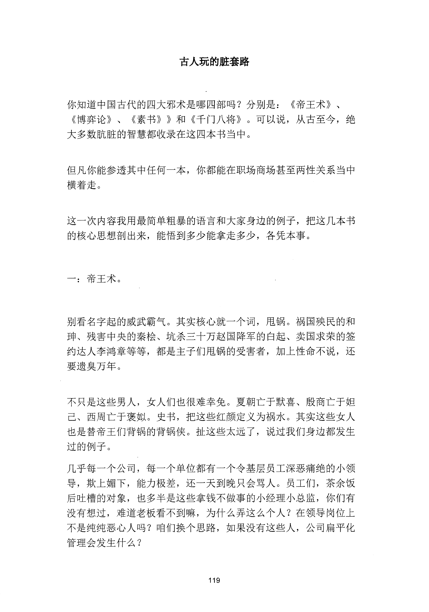
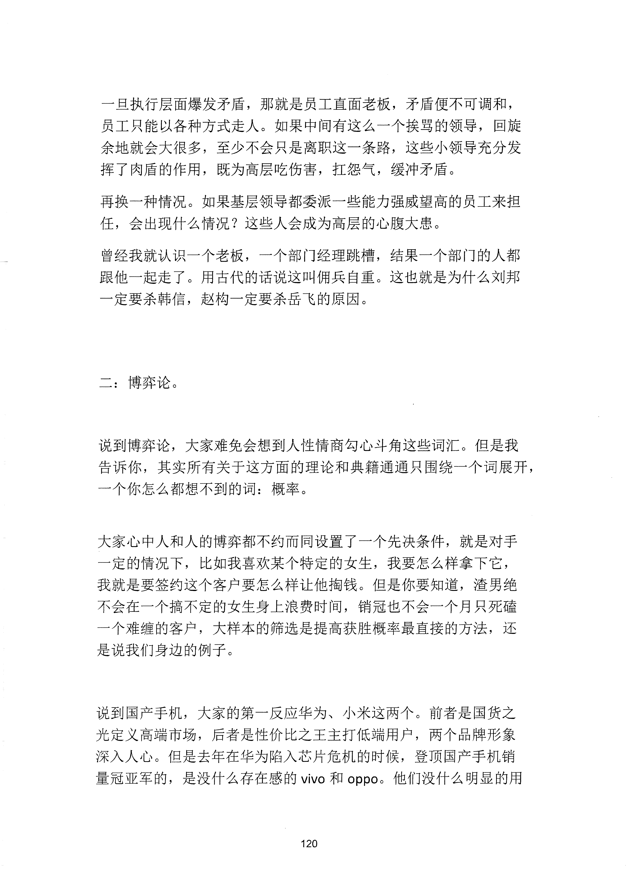
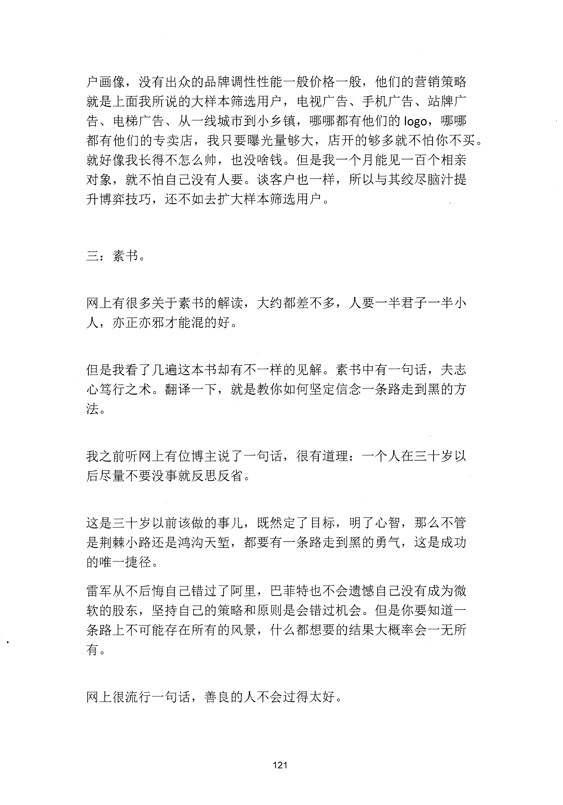
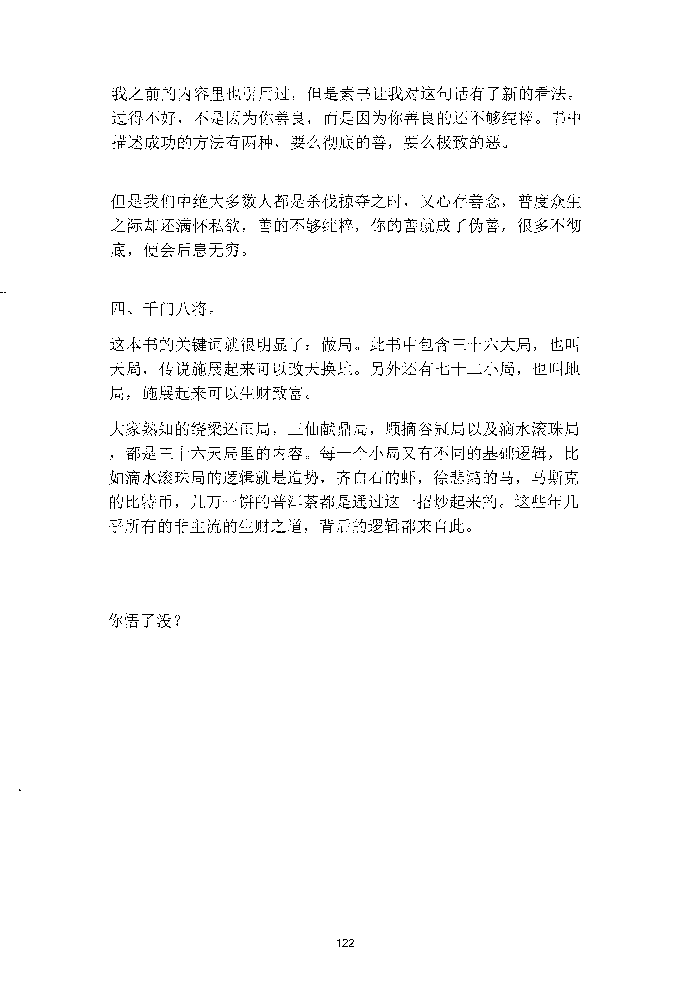

<!-- 原书第 127 页 -->

# 古人玩的脏套路

你知道中国古代的四大邪术是哪四部吗？分别是：

《帝王术》、《博弈论》、

《素书》》和《千门八将》。可以说，从古至今，绝大多数肮脏的智慧都收录在这四本书当中。

但凡你能参透其中任何一本，你都能在职场商场甚至两性关系当中横着走。

这一次内容我用最简单粗暴的语言和大家身边的例子，把这几本书的核心思想剖出来，能悟到多少能拿走多少，各凭本事。

一：帝王术。

别看名字起的威武霸气。其实核心就一个词，甩锅。祸国殃民的和珅、残害中央的秦桧、坑杀三十万赵国降军的白起、卖国求荣的签约达人李鸿章等等，都是主子们甩锅的受害者，加上性命不说，还要遗臭万年。

不只是这些男人，女人们也很难幸免。夏朝亡于默喜、殷商亡于姐己、西周亡于褒拟。史书，把这些红颜定义为祸水。其实这些女人也是替帝王们背锅的背锅侠。扯这些太远了，说过我们身边都发生过的例子。几乎每一个公司，每一个单位都有一个令基层员工深恶痛绝的小领导，欺上媚下，能力极差，还一天到晚只会骂人。员工们，茶余饭后吐槽的对象，也多半是这些拿钱不做事的小经理小总监，你们有没有想过，难道老板看不到嘛，为什么弄这么个人？在领导岗位上不是纯纯恶心人吗？咱们换个思路，如果没有这些人，公司扁平化管理会发生什么？

<!-- source-image-start -->

查看原书第 127 页影像

<!-- source-image-end -->
<!-- 原书第 128 页 -->

一旦执行层面爆发矛盾，那就是员工直面老板，矛盾便不可调和，员工只能以各种方式走人。如果中间有这么一个挨骂的领导，回旋余地就会大很多，至少不会只是离职这一条路，这些小领导充分发挥了肉盾的作用，既为高层吃伤害，扛怨气，缓冲矛盾。再换一种情况。如果基层领导都委派一些能力强威望高的员工来担任，会出现什么情况？这些人会成为高层的心腹大患。曾经我就认识一个老板，一个部门经理跳槽，结果一个部门的人都跟他一起走了。用古代的话说这叫佣兵自重。这也就是为什么刘邦一定要杀韩信，赵构一定要杀岳飞的原因。

二：博弈论。

说到博弈论，大家难免会想到入性情商勾心斗角这些词汇。但是我告诉你，其实所有关于这方面的理论和典籍通通只围绕一个词展开，一个你怎么都想不到的词：概率。

大家心中人和人的博弈都不约而同设置了一个先决条件，就是对手一定的情况下，比如我喜欢某个特定的女生，我要怎么样拿下它，我就是要签约这个客户要怎么样让他掏钱。但是你要知道，渣男绝不会在一个搞不定的女生身上浪费时间，销冠也不会一个月只死磕一个难缠的客户，大样本的筛选是提高获胜概率最直接的方法，还是说我们身边的例子。

说到国产手机，大家的第一反应华为、小米这两个。前者是国货之光定义高端市场，后者是性价比之王主打低端用户，两个品牌形象深入人心。但是去年在华为陷入芯片危机的时候，登顶国产手机销量冠亚军的，是没什么存在感的vivo 和oppo。他们没什么明显的用

<!-- source-image-start -->

查看原书第 128 页影像

<!-- source-image-end -->
<!-- 原书第 129 页 -->

户画像，没有出众的品牌调性性能一般价格一般，他们的营销策略就是上面我所说的大样本筛选用户，电视广告、手机广告、站牌广告、电梯广告、从一线城市到小乡镇，哪哪都有他们的logo,

哪哪都有他们的专卖店，我只要曝光量够大，店开的够多就不怕你不买。就好像我长得不怎么帅，也没啥钱。但是我一个月能见一百个相亲对象，就不怕自己没有人要。谈客户也一样，所以与其绞尽脑汁提升博弈技巧，还不如去扩大样本筛选用户。

三：素书。

网上有很多关于素书的解读，大约都差不多，人要一半君子一半小人，亦正亦邪才能混的好。

但是我看了几遍这本书却有不一样的见解。素书中有一句话，夫志心笃行之术。翻译一下，就是教你如何坚定信念一条路走到黑的方法。

我之前听网上有位博主说了一句话，很有道理：一个人在三十岁以后尽量不要没事就反思反省。

这是三十岁以前该做的事儿，既然定了目标，明了心智，那么不管是荆棘小路还是鸿沟天堑，都要有一条路走到黑的勇气，这是成功的唯一捷径。雷军从不后海自己错过了阿里，巴菲特也不会遗憾自己没有成为微软的股东，坚持自己的策略和原则是会错过机会。但是你要知道一条路上不可能存在所有的风景，什么都想要的结果大概率会一无所有。

网上很流行一句话，善良的人不会过得太好。

<!-- source-image-start -->

查看原书第 129 页影像

<!-- source-image-end -->
<!-- 原书第 130 页 -->

我之前的内容里也引用过，但是素书让我对这句话有了新的看法。过得不好，不是因为你善良，而是因为你善良的还不够纯粹。书中描述成功的方法有两种，要么彻底的善，要么极致的恶。

但是我们中绝大多数人都是杀伐掠夺之时，又心存善念，普度众生之际却还满怀私欲，善的不够纯粹，你的善就成了伪善，很多不彻底，便会后患无穷。

四、千门八将。这本书的关键词就很明显了：做局。此书中包含三十六大局，也叫天局，传说施展起来可以改天换地。另外还有七十二小局，也叫地局，施展起来可以生财致富。大家熟知的绕梁还田局，三仙献鼎局，顺摘谷冠局以及滴水滚珠局，都是三十六天局里的内容。每一个小局又有不同的基础逻辑，比如滴水滚珠局的逻辑就是造势，齐臼石的虾，徐悲鸿的马，马斯克的比特币，几万一饼的普泻茶都是通过这一招炒起来的。这些年几乎所有的非主流的生财之道，背后的逻辑都来自此。

你悟了没？

<!-- source-image-start -->

查看原书第 130 页影像

<!-- source-image-end -->
