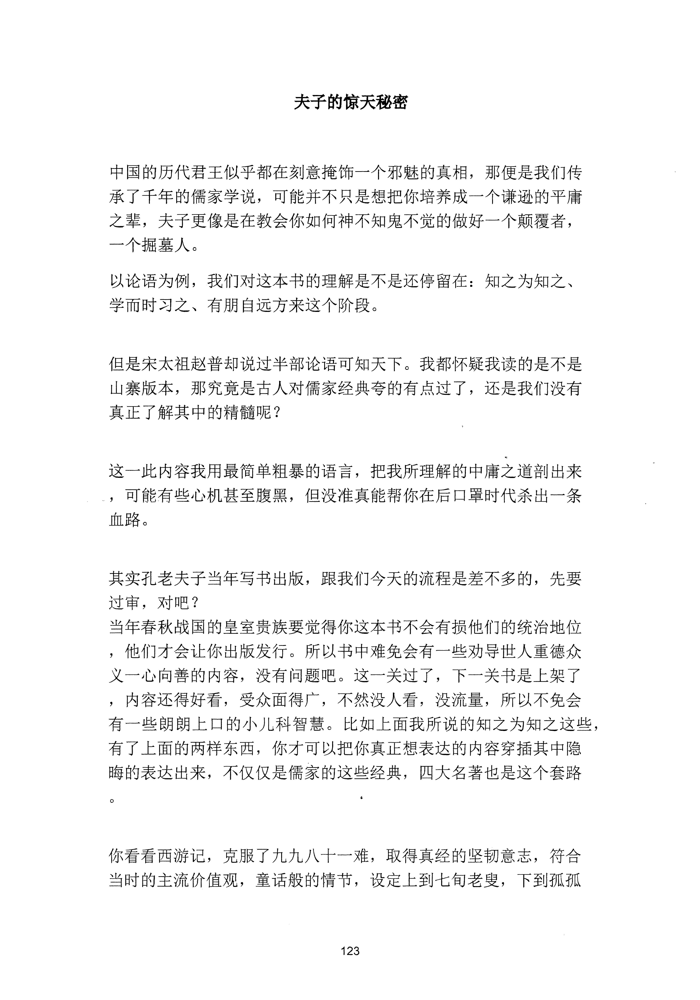
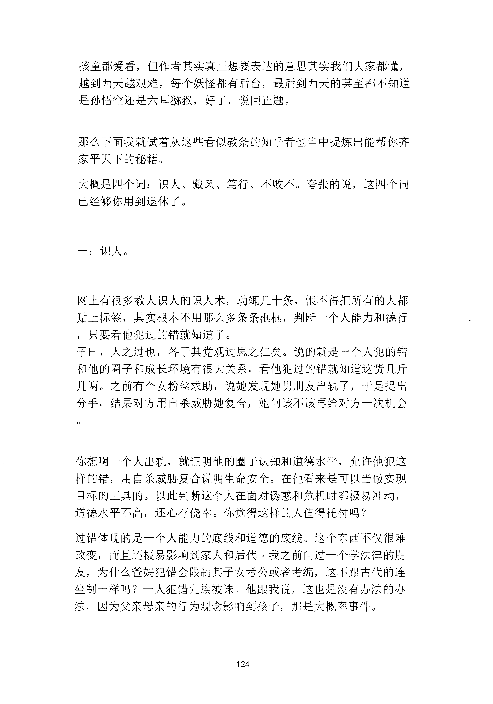
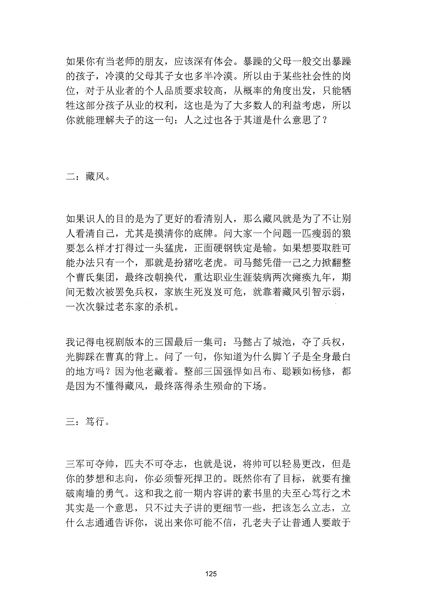
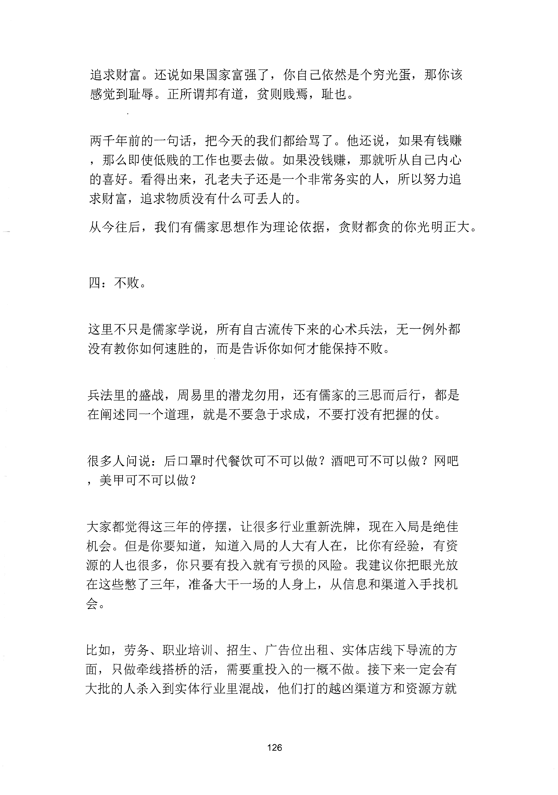
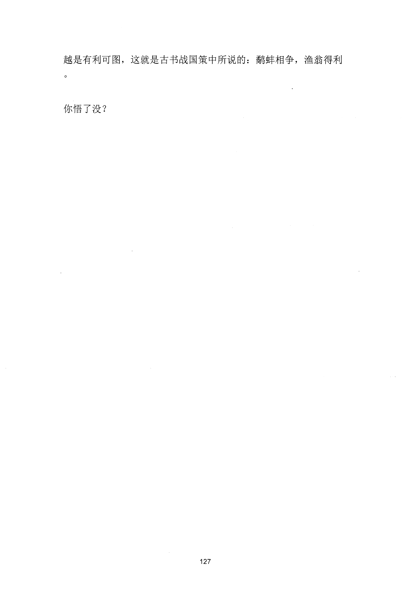

<!-- 原书第 131 页 -->

# 夫子的惊天秘密

中国的历代君王似乎都在刻意掩饰一个邪魅的真相，那便是我们传
承了千年的儒家学说，可能并不只是想把你培养成一个谦逊的平庸
之辈，夫子更像是在教会你如何神不知鬼不觉的做好一个颠覆者，
一个掘墓人。
以论语为例，我们对这本书的理解是不是还停留在：知之为知之、
学而时习之、有朋自远方来这个阶段。
但是宋太祖赵普却说过半部论语可知天下。我都怀疑我读的是不是
山寨版本，那究竟是古人对儒家经典夸的有点过了，还是我们没有
真正了解其中的精髓呢？
这一此内容我用最简单粗暴的语言，把我所理解的中庸之道剖出来
，可能有些心机甚至腹黑，但没准真能帮你在后口罩时代杀出一条
血路。
其实孔老夫子当年写书出版，跟我们今天的流程是差不多的，先要
过审，对吧？
当年春秋战国的皇室贵族要觉得你这本书不会有损他们的统治地位
，他们才会让你出版发行。所以书中难免会有一些劝导世人重德众
义一心向善的内容，没有问题吧。这一关过了，下一关书是上架了
，内容还得好看，受众面得广，不然没人看，没流量，所以不免会
有一些朗朗上口的小儿科智慧。比如上面我所说的知之为知之这些，
有了上面的两样东西，你才可以把你真正想表达的内容穿插其中隐
晦的表达出来，不仅仅是儒家的这些经典，四大名著也是这个套路
你看看西游记，克服了九九八十一难，取得真经的坚韧意志，符合
当时的主流价值观，童话般的情节，设定上到七旬老叟，下到孤孤
123
更多kr66e9gs

<!-- source-image-start -->

查看原书第 131 页影像

<!-- source-image-end -->

<!-- 原书第 132 页 -->

孩童都爱看，但作者其实真正想要表达的意思其实我们大家都懂，
越到西天越艰难，每个妖怪都有后台，最后到西天的甚至都不知道
是孙悟空还是六耳称猴，好了，说回正题。
那么下面我就试着从这些看似教条的知乎者也当中提炼出能帮你齐
家平天下的秘籍。
大概是四个词：识人、藏风、笃行、不败不。夸张的说，这四个词
已经够你用到退休了。
一：识人。
网上有很多教人识人的识人术，动辄几十条，恨不得把所有的人都
贴上标签，其实根本不用那么多条条框框，判断一个人能力和德行
，只要看他犯过的错就知道了。
子荨人之过也，各于其党观过思之仁矣。说的就是一个人犯的错
和他的圈子和成长环境有很大关系，看他犯过的错就知道这货几斤
几两。之前有个女粉丝求助，说她发现她男朋友出轨了，于是提出
分手，结果对方用自杀威胁她复合，她问该不该再给对方一次机会
你想啊一个人出轨，就证明他的圈子认知和道德水平，允许他犯这
样的错，用自杀威胁复合说明生命安全。在他看来是可以当做实现
目标的工具的。以此判断这个人在面对诱惑和危机时都极易冲动，
道德水平不高，还心存侥幸。你觉得这样的人值得托付吗？
过错体现的是一个人能力的底线和道德的底线。这个东西不仅很难
改变，而且还极易影响到家人和后代。心我之前问过一个学法律的朋
友，为什么爸妈犯错会限制其子女考公或者考编，这不跟古代的连
坐制一样吗？一人犯错九族被诛。他跟我说，这也是没有办法的办
法。因为父亲母亲的行为观念影响到孩子，那是大概率事件。
124
更多kr66e9gs

<!-- source-image-start -->

查看原书第 132 页影像

<!-- source-image-end -->

<!-- 原书第 133 页 -->

如果你有当老师的朋友，应该深有体会。暴躁的父母一般交出暴躁
的孩子，冷漠的父母其子女也多半冷漠。所以由于某些社会性的岗
位，对于从业者的个人品质要求较高，从概率的角度出发，只能牺
牲这部分孩子从业的权利，这也是为了大多数人的利益考虑，所以
你就能理解夫子的这一句：人之过也各于其道是什么意思了？
二：藏风。
如果识人的目的是为了更好的看清别人，那么藏风就是为了不让别
人看清自己，尤其是摸清你的底牌。问大家一个问题一匹瘦弱的狼
要怎么样才打得过一头猛虎，正面硬钢铁定是输。如果想要取胜可
能办法只有一个，那就是扮猪吃老虎。司马懿凭借一己之力掀翻整
个曹氏集团，最终改朝换代，重达职业生涯装病两次瘫痪九年，期
间无数次被罢免兵权，家族生死发峎可危，就靠着藏风引智示弱，
一次次躲过老东家的杀机。
我记得电视剧版本的三国最后一集司：马懿占了城池，夺了兵权，
光脚踩在曹真的背上。问了一句，你知道为什么脚丫子是全身最白
的地方吗？因为他老藏着。整部三国强悍如吕布、聪颖如杨修，都
是因为不懂得藏风，最终落得杀生殁命的下场。
三：笃行。
三军可夺帅，匹夫不可夺志，也就是说，将帅可以轻易更改，但是
你的梦想和志向，你必须誓死捍卫的。既然你有了目标，就要有撞
破南墙的勇气。这和我之前一期内容讲的素书里的夫至心笃行之术
其实是一个意思，只不过夫子讲的更细节一些，把该怎么立志，立
什么志通通告诉你，说出来你可能不信，孔老夫子让普通人要敢千
125
更多kr66e9gs

<!-- source-image-start -->

查看原书第 133 页影像

<!-- source-image-end -->

<!-- 原书第 134 页 -->

追求财富。还说如果国家富强了，你自己依然是个穷光蛋，那你该
感觉到耻辱。正所谓邦有道，贫则贱焉，耻也。
两千年前的一句话，把今天的我们都给骂了。他还说，如果有钱赚
，那么即使低贱的工作也要去做。如果没钱赚，那就听从自己内心
的喜好。看得出来，孔老夫子还是一个非常务实的人，所以努力追
求财富，追求物质没有什么可丢人的。
从今往后，我们有儒家思想作为理论依据，贪财都贪的你光明正大。
四：不败。
这里不只是儒家学说，所有自古流传下来的心术兵法，无一例外都
没有教你如何速胜的，而是告诉你如何才能保持不败。
兵法里的盛战，周易里的潜龙勿用，还有儒家的三思而后行，都是
在阐述同一个道理，就是不要急千求成，不要打没有把握的仗。
很多人问说：后口罩时代餐饮可不可以做？酒吧可不可以做？网吧
，美甲可不可以做？
大家都觉得这三年的停摆，让很多行业重新洗牌，现在入局是绝佳
机会。但是你要知道，知道入局的人大有人在，比你有经验，有资
源的人也很多，你只要有投入就有亏损的风险。我建议你把眼光放
在这些憋了三年，准备大干一场的人身上，从信息和渠道入手找机
/ 云。
比如，劳务、职业培训、招生、广告位出租、实体店线下导流的方
面，只做牵线搭桥的活，需要重投入的一概不做。接下来一定会有
大批的人杀入到实体行业里混战，他们打的越凶渠道方和资源方就
126
更多kr66e9gs

<!-- source-image-start -->

查看原书第 134 页影像

<!-- source-image-end -->

<!-- 原书第 135 页 -->

越是有利可图，这就是古书战国策中所说的：鹅蚌相争，渔翁得利
你悟了没？
127
更多kr66e9gs

<!-- source-image-start -->

查看原书第 135 页影像

<!-- source-image-end -->
