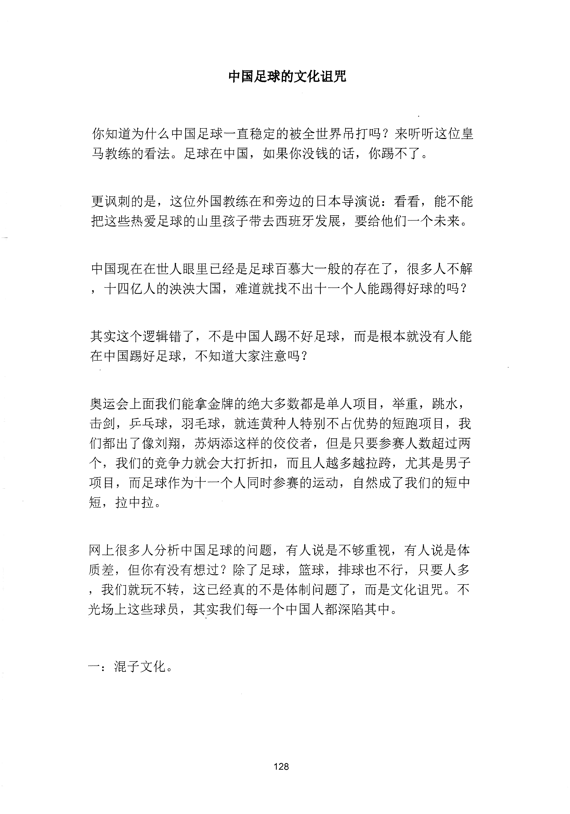
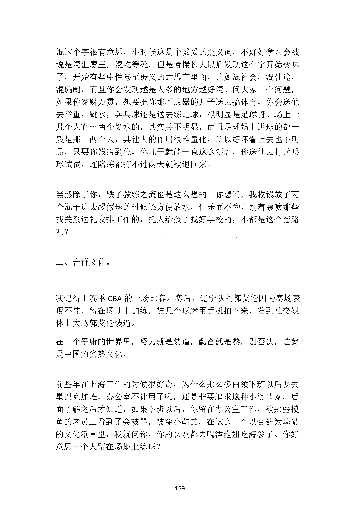
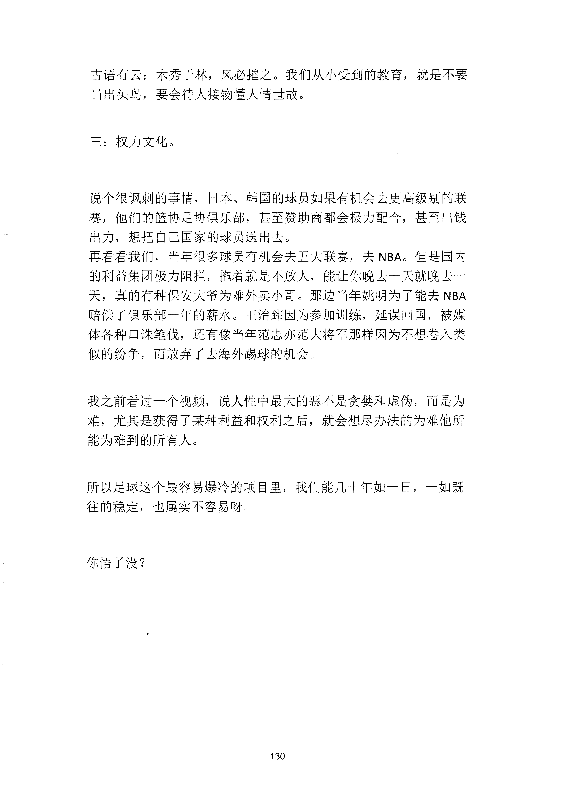

<!-- 原书第 136 页 -->

# 中国足球的文化诅咒

你知道为什么中国足球一直稳定的被全世界吊打吗？来听听这位皇马教练的看法。足球在中国，如果你没钱的话，你踢不了。

更讽刺的是，这位外国教练在和旁边的日本导演说：看看，能不能把这些热爱足球的山里孩子带去西班牙发展，要给他们一个未来。

中国现在在世人眼里已经是足球百慕大一般的存在了，很多人不解，十四亿人的决决大国，难道就找不出十一个人能踢得好球的吗？

其实这个逻辑错了，不是中国人踢不好足球，而是根本就没有人能在中国踢好足球，不知道大家注意吗？

奥运会上面我们能拿金牌的绝大多数都是单人项目，举重，跳水，击剑，乒乓球，羽毛球，就连黄种人特别不占优势的短跑项目，我们都出了像刘翔，苏炳添这样的佼佼者，但是只要参赛人数超过两个，我们的竞争力就会大打折扣，而且人越多越拉跨，尤其是男子项目，而足球作为十一个人同时参赛的运动，自然成了我们的短中短，拉中拉。

网上很多人分析中国足球的问题，有人说是不够重视，有人说是体质差，但你有没有想过？除了足球，篮球，排球也不行，只要人多，我们就玩不转，这已经真的不是体制问题了，而是文化诅咒。不光场上这些球员，其实我们每一个中国人都深陷其中。

一：混子文化。

<!-- source-image-start -->

查看原书第 136 页影像

<!-- source-image-end -->
<!-- 原书第 137 页 -->

混这个字很有意思，小时候这是个妥妥的贬义词，不好好学习会被说是混世魔王，混吃等死。但是慢慢长大以后发现这个字开始变味了，开始有些中性甚至褒义的意思在里面，比如混社会，混仕途，混编制，而且你会发现越是人多的地方越好混。问大家一个问题，如果你家财万贯，想要把你那不成器的儿子送去搞体育，你会送他去举重，跳水，乒乓球还是送去练足球，很明显是足球呀。场上十几个人有一两个划水的，其实并不明显，而且足球场上进球的都一般是那一两个人，其他人的作用很难量化，所以好坏看上去也不明显，只要你钱给到位，你儿子就能一直这么混着，你送他去打乒乓球试试，连陪练都打不过两天就被退回来。

当然除了你，铁子教练之流也是这么想的。你想啊，我收钱放了两个混子进去踢假球的时候还方便放水，何乐而不为？别着急喷那些找关系送礼安排工作的，托人给孩子找好学校的，不都是这个套路吗？

二、合群文化。

我记得上赛季CBA 的一场比赛。赛后，辽宁队的郭艾伦因为赛场表现不佳，留在场地上加练，被几个球迷用手机拍下来，发到补交媒体上大骂郭艾伦装逼。在一个平庸的世界里，努力就是装逼，勤奋就是卷，别否认，这就是中国的劣势文化。

前些年在上海工作的时候很好奇，为什么那么多白领下班以后要去星巴克加班，办公室不让用了吗，还是非要追求这种小资情家，后面了解之后才知道，如果下班以后，你留在办公室工作，被那些摸鱼的老员工看到了会被骂，被穿小鞋的，在这么一个以合群为基础的文化氛围里，我就问你，你的队友都去喝酒泡妞吃海参了。你好意思一个人留在场地上练球？

<!-- source-image-start -->

查看原书第 137 页影像

<!-- source-image-end -->
<!-- 原书第 138 页 -->

古语有云：木秀千林，风必摧之。我们从小受到的教育，就是不要当出头鸟，要会待人接物懂人情世故。

三：权力文化。

说个很讽剌的事情，日本、韩国的球员如果有机会去更高级别的联赛，他们的篮协足协俱乐部，甚至赞助商都会极力配合，甚至出钱出力，想把自己国家的球员送出去。再看看我们，当年很多球员有机会去五大联赛，去NBA。但是国内的利益集团极力阻拦，拖着就是不放人，能让你晚去一天就晚去一天，真的有种保安大爷为难外卖小哥。那边当年姚明为了能去NBA赔偿了俱乐部一年的薪水。王治郅因为参加训练，延误回国，被媒体各种口诛笔伐，还有像当年范志亦范大将军那样因为不想卷入类似的纷争，而放弃了去海外踢球的机会。

我之前看过一个视频，说人性中最大的恶不是贪婪和虚伪，而是为难，尤其是获得了某种利益和权利之后，就会想尽办法的为难他所能为难到的所有人。

所以足球这个最容易爆冷的项目里，我们能几十年如一日，一如既往的稳定，也属实不容易呀。

你悟了没？

<!-- source-image-start -->

查看原书第 138 页影像

<!-- source-image-end -->
