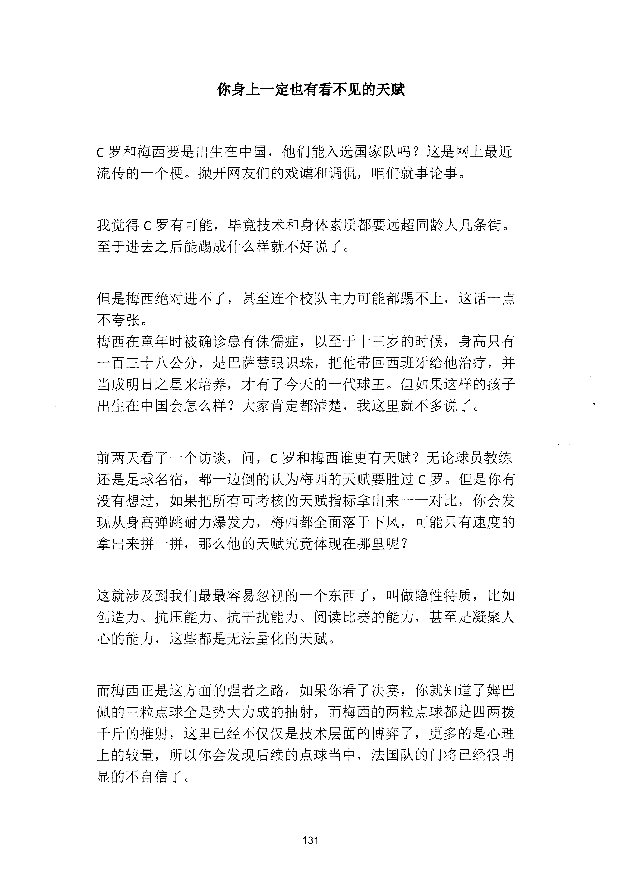
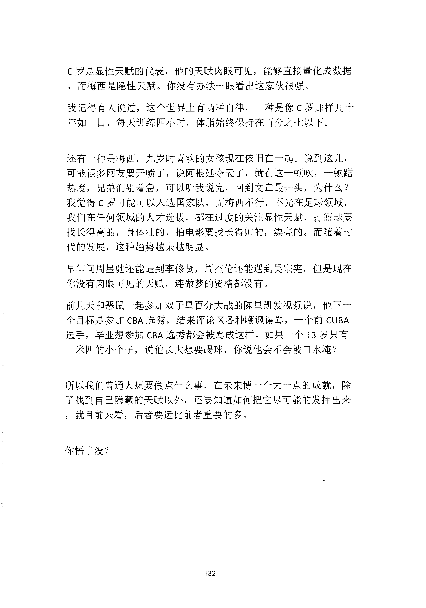

<!-- 原书第 139 页 -->

# 你身上一定也有看不见的天赋

C 罗和梅西要是出生在中国，他们能入选国家队吗？这是网上最近流传的一个梗。抛开网友们的戏谑和调侃，咱们就事论事。

我觉得C 罗有可能，毕竟技术和身体素质都要远超同龄人几条街。至于进去之后能踢成什么样就不好说了。

但是梅西绝对进不了，甚至连个校队主力可能都踢不上，这话一点不夸张。梅西在童年时被确诊患有侏儒症，以至于十三岁的时候，身高只有一百三十八公分，是巴萨慧眼识珠，把他带回西班牙给他治疗，并当成明日之星来培养，才有了今天的一代球王。但如果这样的孩子出生在中国会怎么样？大家肯定都清楚，我这里就不多说了。

前两天看了一个访谈，问，

C 罗和梅西谁更有天赋？无论球员教练还是足球名宿，都一边倒的认为梅西的天赋要胜过C 罗。但是你有没有想过，如果把所有可考核的天赋指标拿出来一一对比，你会发现从身高弹跳耐力爆发力，梅西都全面落千下风，可能只有速度的拿出来拼一拼，那么他的天赋究竟体现在哪里呢？

这就涉及到我们最最容易忽视的一个东西了，叫做隐性特质，比如创造力、抗压能力、抗干扰能力、阅读比赛的能力，甚至是凝聚人心的能力，这些都是无法量化的天赋。

而梅西正是这方面的强者之路。如果你看了决赛，你就知道了姆巴佩的三粒点球全是势大力成的抽射，而梅西的两粒点球都是四两拨千斤的推射，这里已经不仅仅是技术层面的博弈了，更多的是心理上的较量，所以你会发现后续的点球当中，法国队的门将已经很明显的不自信了。

<!-- source-image-start -->

查看原书第 139 页影像

<!-- source-image-end -->
<!-- 原书第 140 页 -->

C 罗是显性天赋的代表，他的天赋肉眼可见，能够直接量化成数据，而梅西是隐性天赋。你没有办法一眼看出这家伙很强。我记得有人说过，这个世界上有两种自律，一种是像C 罗那样几十年如一曰，每天训练四小时，体脂始终保持在百分之七以下。

还有一种是梅西，九岁时喜欢的女孩现在依旧在一起。说到这儿，可能很多网友要开喷了，说阿根廷夺冠了，就在这一顿吹，一顿躇热度，兄弟们别着急，可以听我说完，回到文章最开头，为什么？我觉得C 罗可能可以入选国家队，而衔西不行，不光在足球领域，我们在任何领域的人才选拔，都在过度的关注显性天赋，打篮球要找长得高的，身体壮的，拍电影要找长得帅的，漂亮的。而随着时代的发展，这种趋势越来越明显。早年间周星驰还能遇到李修贤，周杰伦还能遇到吴宗宪。但是现在你没有肉眼可见的天赋，连做梦的资格都没有。前几天和恶鼠一起参加双子星百分大战的陈星凯发视频说，他下一个目标是参加CBA 选秀，结果评论区各种嘲讽谩骂，一个前CUBA选手，毕业想参加CBA 选秀都会被骂成这样。如果一个13岁只有一米四的小个子，说他长大想要踢球，你说他会不会被口水淹？

所以我们普通人想要做点什么事，在未来博一个大一点的成就，除了找到自己隐藏的天赋以外，还要知道如何把它尽可能的发挥出来，就目前来看，后者要远比前者重要的多。

你悟了没？

<!-- source-image-start -->

查看原书第 140 页影像

<!-- source-image-end -->
