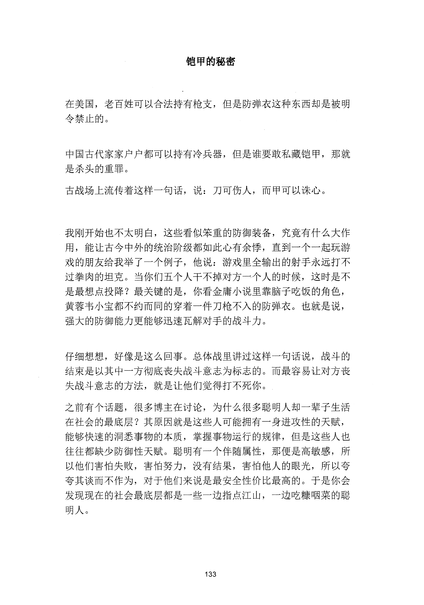
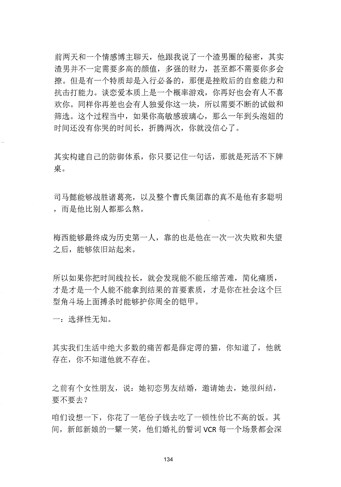
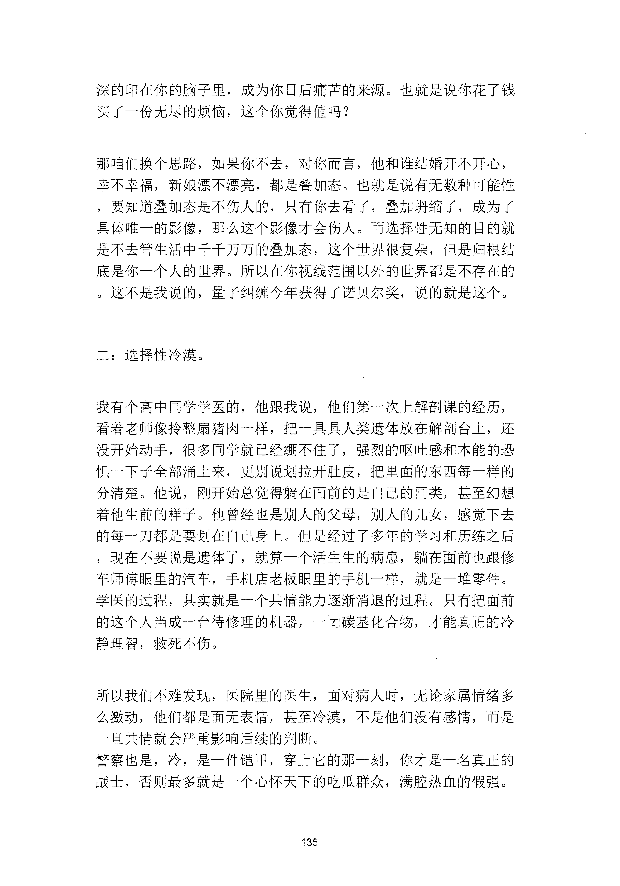
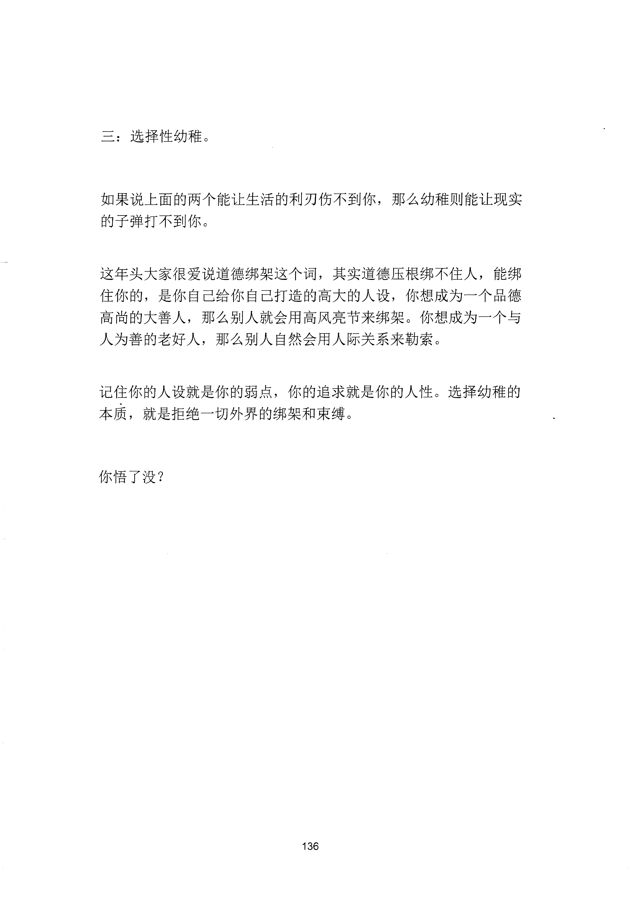

<!-- 原书第 141 页 -->

# 铠甲的秘密

在美国，老百姓可以合法持有枪支，但是防弹衣这种东西却是被明令禁止的。

中国古代家家户户都可以持有冷兵器，但是谁要敢私藏铠甲，那就是杀头的重罪。古战场上流传着这样一句话，说：刀可伤人，而甲可以诛心。

我刚开始也不太明白，这些看似笨重的防御装备，究竟有什么大作用，能让古今中外的统治阶级都如此心有余悸，直到一个一起玩游戏的朋友给我举了一个例子，他说：游戏里全输出的射手永远打不过拳肉的坦克。当你们五个人干不掉对方一个人的时候，这时是不是最想点投降？最关键的是，你看金庸小说里靠脑子吃饭的角色，黄蓉韦小宝都不约而同的穿着一件刀枪不入的防弹衣。也就是说，强大的防御能力更能够迅速瓦解对手的战斗力。

仔细想想，好像是这么回事。总体战里讲过这样一句话说，战斗的结束是以其中一方彻底丧失战斗意志为标志的。而最容易让对方丧失战斗意志的方法，就是让他们觉得打不死你。之前有个话题，很多博主在讨论，为什么很多聪明人却一辈子生活在社会的最底层？其原因就是这些人可能拥有一身进攻性的天赋，能够快速的洞悉事物的本质，掌握事物运行的规律，但是这些人也往往都缺少防御性天赋。聪明有一个伴随属性，那便是高敏感，所以他们害怕失败，害怕努力，没有结果，害怕他人的眼光，所以夸夸其谈而不作为，对于他们来说是最安全性价比最高的。于是你会发现现在的社会最底层都是一些一边指点江山，一边吃糠咽菜的聪明人。

<!-- source-image-start -->

查看原书第 141 页影像

<!-- source-image-end -->
<!-- 原书第 142 页 -->

前两天和一个情感博主聊天，他跟我说了一个渣男圈的秘密，其实渣男并不一定需要多高的颜值，多强的财力，甚至都不需要你多会撩。但是有一个特质却是入行必备的，那便是挫败后的自愈能力和抗击打能力。谈恋爱本质上是一个概率游戏，你再好也会有人不喜欢你。同样你再差也会有人独爱你这一块，所以需要不断的试做和筛选。这个过程当中，如果你高敏感玻璃心，那么一年到头泡妞的时间还没有你哭的时间长，折腾两次，你就没信心了。

其实构建自己的防御体系，你只要记住一句话，那就是死活不下牌桌。

司马懿能够战胜诸葛亮，以及整个曹氏集团靠的真不是他有多聪明，而是他比别人都那么熬。

梅西能够最终成为历史第一人，靠的也是他在一次一次失败和失望之后，能够依旧站起来。

所以如果你把时间线拉长，就会发现能不能压缩苦难，简化痛质，才是一个人能不能拿到结果的首要素质，才是你在社会这个巨型角斗场上面搏杀时能够护你周全的铠甲。一：选择性无知。

其实我们生活中绝大多数的痛苦都是薛定谔的猫，你知道了，他就存在，你不知道他就不存在。

之前有个女性朋友，说：她初恋男友结婚，邀请她去，她很纠结，要不要去？咱们设想一下，你花了一笔份子钱去吃了一顿性价比不高的饭。其间，新郎新娘的一暨一笑，他们婚礼的誓词VCR 每一个场景都会深

<!-- source-image-start -->

查看原书第 142 页影像

<!-- source-image-end -->
<!-- 原书第 143 页 -->

深的印在你的脑子里，成为你曰后痛苦的来源。也就是说你花了钱买了一份无尽的烦恼，这个你觉得值吗？

那咱们换个思路，如果你不去，对你而言，他和谁结婚开不开心，幸不幸福，新娘漂不漂亮，都是叠加态。也就是说有无数种可能性，要知道叠加态是不伤人的，只有你去看了，叠加坍缩了，成为了具体唯一的影像，那么这个影像才会伤人。而选择性无知的目的就是不去管生活中千于万万的叠加态，这个世界很复杂，但是归根结底是你一个人的世界。所以在你视线范围以外的世界都是不存在的。这不是我说的，量子纠缠今年获得了诺贝尔奖，说的就是这个。

二：选择性冷漠。

我有个高中同学学医的，他跟我说，他们第一次上解剖课的经历，看着老师像拎整扇猪肉一样，把一具具人类遗体放在解剖台上，还没开始动手，很多同学就已经绷不住了，强烈的呕吐感和本能的恐惧一下子全部涌上来，更别说划拉开肚皮，把里面的东西每一样的分清楚。他说，刚开始总觉得躺在面前的是自己的同类，甚至幻想着他生前的样子。他曾经也是别人的父母，别人的儿女，感觉下去的每一刀都是要划在自己身上。但是经过了多年的学习和历练之后，现在不要说是遗体了，就算一个活生生的病患，躺在面前也跟修车师傅眼里的汽车，手机店老板眼里的手机一样，就是一堆零件。学医的过程，其实就是一个共情能力逐渐消退的过程。只有把面前的这个人当成一台待修理的机器，一团碳基化合物，才能真正的冷静理智，救死扶伤。

所以我们不难发现，医院里的医生，面对病人时，无论家属情绪多么激动，他们都是面无表情，甚至冷漠，不是他们没有感情，而是一旦共情就会严重影响后续的判断。警察也是，冷，是一件铠甲，穿上它的那一刻，你才是一名真正的战士，否则最多就是一个心怀天下的吃瓜群众，满腔热血的假强。

<!-- source-image-start -->

查看原书第 143 页影像

<!-- source-image-end -->
<!-- 原书第 144 页 -->

三：选择性幼稚。

如果说上面的两个能让生活的利刃伤不到你，那么幼稚则能让现实的子弹打不到你。

这年头大家很爱说道德绑架这个词，其实道德压根绑不住人，能绑住你的，是你自己给你自己打造的高大的人设，你想成为一个品德高尚的大善人，那么别人就会用高风亮节来绑架。你想成为一个与人为善的老好人，那么别人自然会用人际关系来勒索。

记住你的人设就是你的弱点，你的追求就是你的人性。选择幼稚的本质，就是拒绝一切外界的绑架和束缚。

你悟了没？

<!-- source-image-start -->

查看原书第 144 页影像

<!-- source-image-end -->
