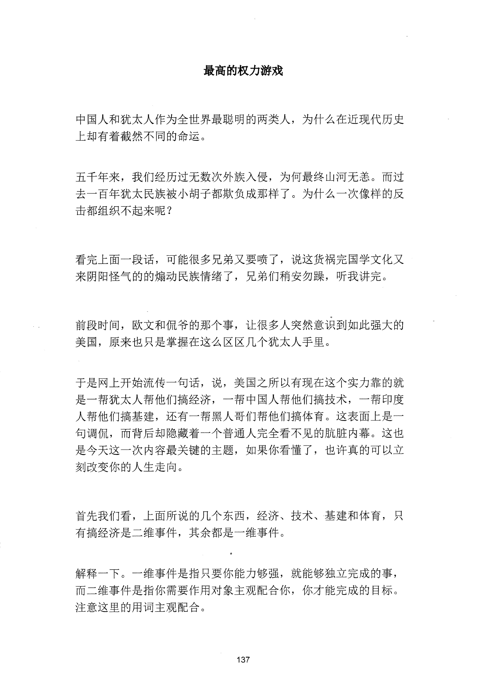
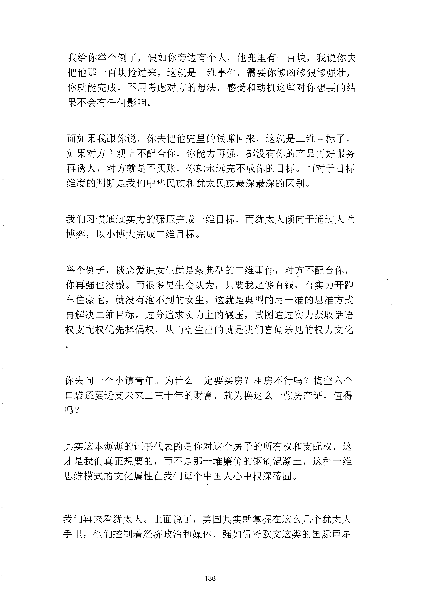
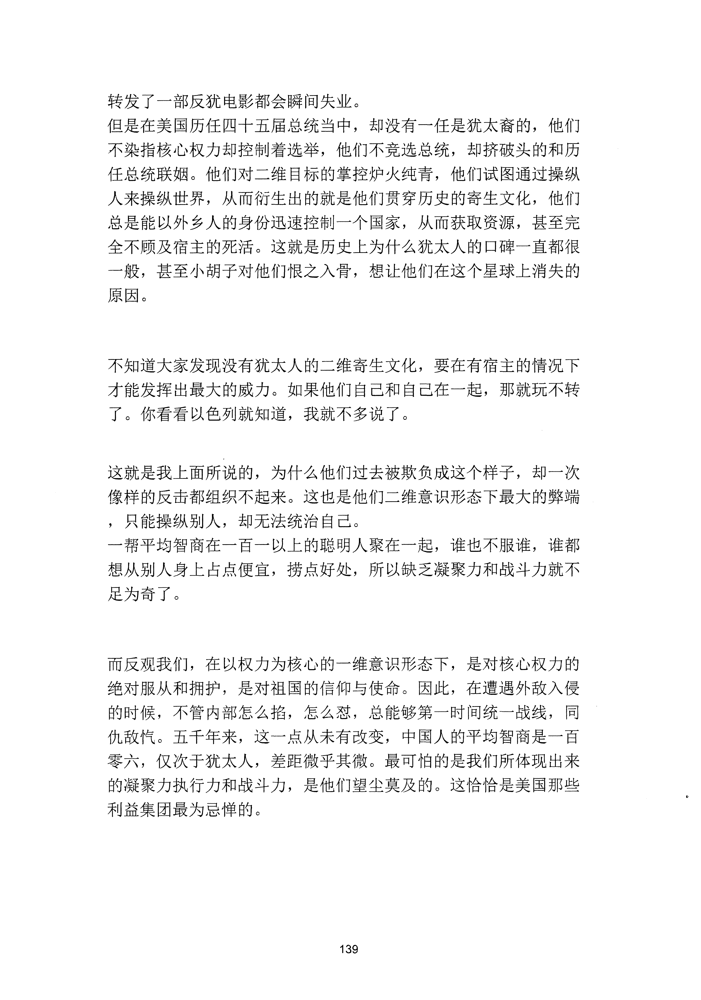

<!-- 原书第 145 页 -->

# 最高的权力游戏

中国人和犹太人作为全世界最聪明的两类人，为什么在近现代历史
上却有着截然不同的命运。
五千年来，我们经历过无数次外族入侵，为何最终山河无恙。而过
去一百年犹太民族被小胡子都欺负成那样了。为什么一次像样的反
击都组织不起来呢？
看完上面一段话，可能很多兄弟又要喷了，说这货祸完国学文化又
来阴阳怪气的的煽动民族情绪了，兄弟们稍安勿躁，听我讲完。
前段时间，欧文和侃爷的那个事，让很多人突然意识到如此强大的
美国，原来也只是掌握在这么区区几个犹太人手里。
于是网上开始流传一句话，说，美国之所以有现在这个实力靠的就
是一帮犹太人帮他们搞经济，一帮中国人帮他们搞技术，一帮印度
人帮他们搞基建，还有一帮黑人哥们帮他们搞体育。这表面上是一
旬调侃，而背后却隐藏着一个普通人完全看不见的肮脏内幕。这也
是今天这一次内容最关键的主题，如果你看懂了，也许真的可以立
刻改变你的人生走向。
首先我们看，上面所说的几个东西，经济、技术、基建和体育，只
有搞经济是二维事件，其余都是一维事件。
解释一下。一维事件是指只要你能力够强，就能够独立完成的事，
而二维事件是指你需要作用对象主观配合你，你才能完成的目标。
注意这里的用词主观配合。
137
更多kr66e9gs

<!-- source-image-start -->

查看原书第 145 页影像

<!-- source-image-end -->

<!-- 原书第 146 页 -->

我给你举个例子，假如你旁边有个人，他兜里有一百块，我说你去
把他那一百块抢过来，这就是一维事件，需要你够凶够狠够强壮，
你就能完成，不用考虑对方的想法，感受和动机这些对你想要的结
果不会有任何影响。
而如果我跟你说，你去把他兜里的钱赚回来，这就是二维目标了。
如果对方主观上不配合你，你能力再强，都没有你的产品再好服务
再诱人，对方就是不买账，你就永远完不成你的目标。而对于目标
维度的判断是我们中华民族和犹太民族最深最深的区别。
我们习惯通过实力的辗压完成一维目标，而犹太人倾向于通过人性
博弈，以小博大完成二维目标。
举个例子，谈恋爱追女生就是最典型的二维事件，对方不配合你，
你再强也没辙。而很多男生会认为，只要我足够有钱，有实力开跑
车住豪宅，就没有泡不到的女生。这就是典型的用一维的思维方式
再解决二维目标。过分追求实力上的硐压，试图通过实力获取话语
权支配权优先择偶权，从而衍生出的就是我们喜闻乐见的权力文化
你去问一个小镇青年。为什么一定要买房？租房不行吗？掏空六个
口袋还要透支未来二三十年的财富，就为换这么一张房产证，值得
吗？
其实这本薄薄的证书代表的是你对这个房子的所有权和支配权，这
才是我们真正想要的，而不是那一堆廉价的钢筋混凝土，这种一维
思维模式的文化属性在我们每个中国人心中根深蒂固。
我们再来看犹太人。上面说了，美国其实就掌握在这么几个犹太人
手里，他们控制着经济政治和媒体，强如侃爷欧文这类的国际巨星
138
更多kr66e9gs

<!-- source-image-start -->

查看原书第 146 页影像

<!-- source-image-end -->

<!-- 原书第 147 页 -->

转发了一部反犹电影都会瞬间失业。
但是在美国历任四十五届总统当中，却没有一任是犹太裔的，他们
不染指核心权力却控制着选举，他们不竞选总统，却挤破头的和历
任总统联姻。他们对二维目标的掌控炉火纯青，他们试图通过操纵
人来操纵世界，从而衍生出的就是他们贯穿历史的寄生文化，他们
总是能以外乡人的身份迅速控制一个国家，从而获取资源，甚至完
全不顾及宿主的死活。这就是历史上为什么犹太人的口碑一直都很
一般，甚至小胡子对他们恨之入骨，想让他们在这个星球上消失的
原因。
不知道大家发现没有犹太人的二维寄生文化，要在有宿主的情况下
才能发挥出最大的威力。如果他们自己和自己在一起，那就玩不转
了。你看看以色列就知道，我就不多说了。
这就是我上面所说的，为什么他们过去被欺负成这个样子，却一次
像样的反击都组织不起来。这也是他们二维意识形态下最大的弊端
，只能操纵别人，却无法统治自己。
一帮平均智商在一百一以上的聪明人聚在一起，谁也不服谁，谁都
想从别人身上占点便宜，捞点好处，所以缺乏凝聚力和战斗力就不
足为奇了。
而反观我们，在以权力为核心的一维意识形态下，是对核心权力的
绝对服从和拥护，是对祖国的信仰与使命。因此，在遭遇外敌入侵
的时候，不管内部怎么抬，怎么怼，总能够第一时间统一战线，同
仇敌汽。五于年来，这一点从未有改变，中国人的平均智商是一百
零六，仅次于犹太人，差距微乎其微。最可怕的是我们所体现出来
的凝聚力执行力和战斗力，是他们望尘莫及的。这恰恰是美国那些
利益集团最为忌惮的。
139
更多kr66e9gs

<!-- source-image-start -->

查看原书第 147 页影像

<!-- source-image-end -->

<!-- 原书第 148 页 -->

其实放在历史的长河当中，任何一种文化，任何一种意识形态都有
其存在的价值和意。这是人类这个物种在不同的环境下进化的结果
，无关立场无关国界。犹太人在几百年的流离失所当中，依旧四处
周旋混的风生水起。当然有他们的可取之处，而我们在饱经风霜之
后，还能够重回世界之巅，也不得不说是伟大的历史奇观。
现在想想还挺幸运的，我是出生在中国这样的地方，这样的内容还
能发表出来，被大家看到，如果换个地方，我想应该也要失业了吧
你悟了没？
140
更多kr66e9gs

<!-- source-image-start -->

查看原书第 148 页影像

<!-- source-image-end -->
