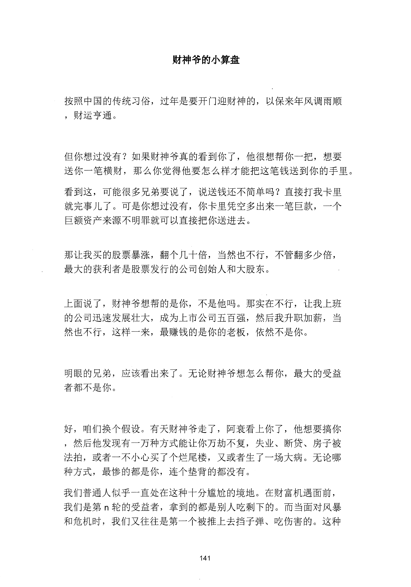
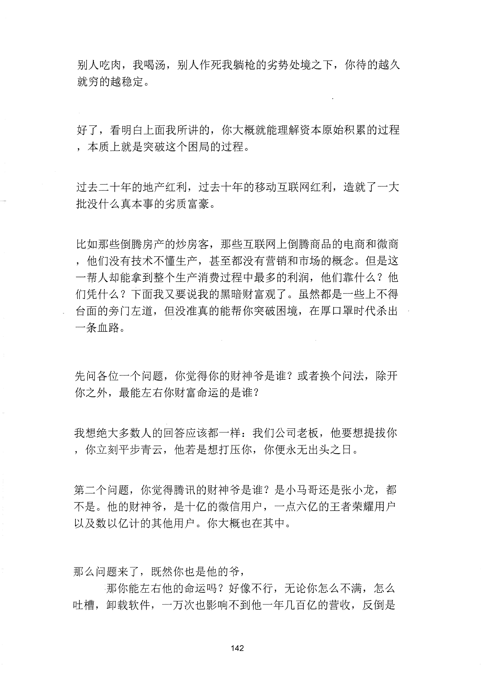
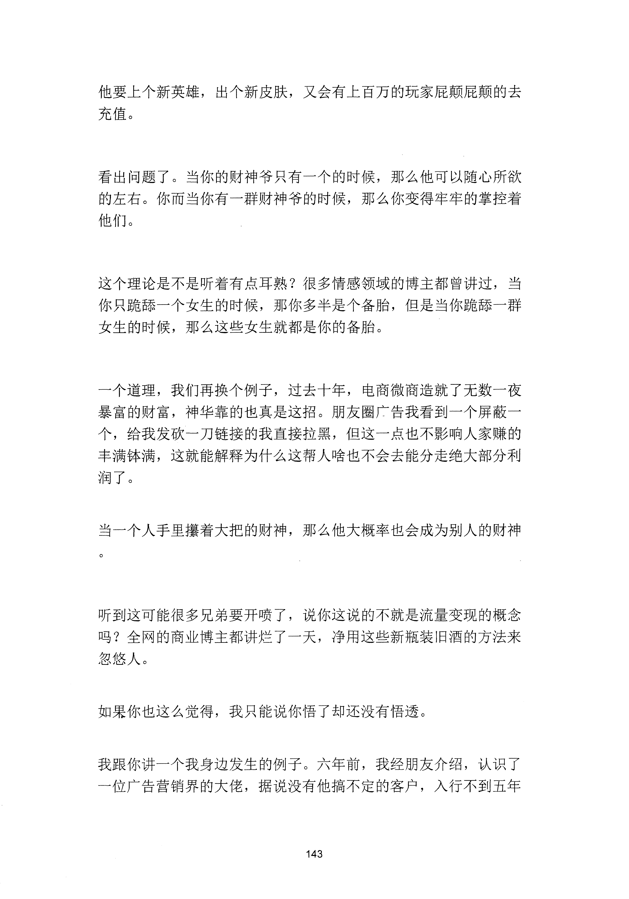
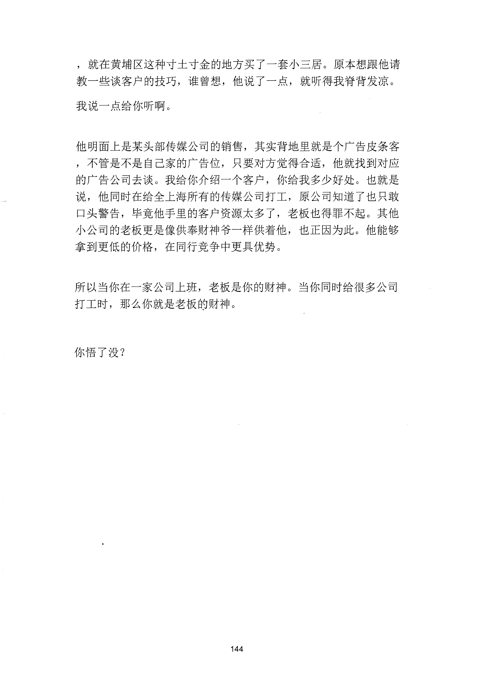

<!-- 原书第 149 页 -->

# 财神爷的小算盘

按照中国的传统习俗，过年是要开门迎财神的，以保来年风调雨顺，财运亨通。

但你想过没有？如果财神爷真的看到你了，他很想帮你一把，想要送你一笔横财，那么你觉得他要怎么样才能把这笔钱送到你的手里。看到这，可能很多兄弟要说了，说送钱还不简单吗？直接打我卡里就完事儿了。可是你想过没有，你卡里凭空多出来一笔巨款，一个巨额资产来源不明罪就可以直接把你送进去。

那让我买的股票暴涨，翻个几十倍，当然也不行，不管翻多少倍，最大的获利者是股票发行的公司创始人和大股东。

上面说了，财神爷想帮的是你，不是他吗。那实在不行，让我上班的公司迅速发展壮大，成为上市公司五百强，然后我升职加薪，当然也不行，这样一来，最赚钱的是你的老板，依然不是你。

明眼的兄弟，应该看出来了。无论财神爷想怎么帮你，最大的受益者都不是你。

好，咱们换个假设。有天财神爷走了，阿衰看上你了，他想要搞你，然后他发现有一万种方式能让你万劫不复，失业、断贷、房子被法拍，或者一不小心买了个烂尾楼，又或者生了一场大病。无论哪种方式，最惨的都是你，连个垫背的都没有。我们普通人似乎一直处在这种十分尴尬的境地。在财富机遇面前，我们是第n 轮的受益者，拿到的都是别人吃剩下的。而当面对风暴和危机时，我们又往往是第一个被推上去挡子弹、吃伤害的。这种

<!-- source-image-start -->

查看原书第 149 页影像

<!-- source-image-end -->
<!-- 原书第 150 页 -->

别人吃肉，我喝汤，别人作死我躺枪的劣势处境之下，你待的越久就穷的越稳定。

好了，看明白上面我所讲的，你大概就能理解资本原始积累的过程，本质上就是突破这个困局的过程。

过去二十年的地产红利，过去十年的移动互联网红利，造就了一大批没什么真本事的劣质富豪。

比如那些倒腾房产的炒房客，那些互联网上倒腾商品的电商和微商，他们没有技术不懂生产，甚至都没有营销和市场的概念。但是这一帮人却能拿到整个生产消费过程中最多的利润，他们靠什么？他们凭什么？下面我又要说我的黑暗财富观了。虽然都是一些上不得台面的旁门左道，但没准真的能帮你突破困境，在厚口罩时代杀出一条血路。

先问各位一个问题，你觉得你的财神爷是谁？或者换个问法，除开你之外，最能左右你财富命运的是谁？

我想绝大多数人的回答应该都一样：我们公司老板，他要想提拔你，你立刻平步青云，他若是想打压你，你便永无出头之曰。

第二个问题，你觉得腾讯的财神爷是谁？是小马哥还是张小龙，都不是。他的财神爷，是十亿的微信用户，一点六亿的王者荣耀用户以及数以亿计的其他用户。你大概也在其中。

那么问题来了，既然你也是他的爷，

那你能左右他的命运吗？好像不行，无论你怎么不满，怎么吐槽，卸载软件，一万次也影响不到他一年几百亿的营收，反倒是

<!-- source-image-start -->

查看原书第 150 页影像

<!-- source-image-end -->
<!-- 原书第 151 页 -->

他要上个新英雄，出个新皮肤，又会有上百万的玩家屁颠屁颠的去充值。

看出问题了。当你的财神爷只有一个的时候，那么他可以随心所欲的左右。你而当你有一群财神爷的时候，那么你变得牢牢的掌控着他们。

这个理论是不是听着有点耳熟？很多情感领域的博主都曾讲过，当你只跪舔一个女生的时候，那你多半是个备胎，但是当你跪舔一群女生的时候，那么这些女生就都是你的备胎。

一个道理，我们再换个例子，过去十年，电商微商造就了无数一夜暴富的神话，靠的也真是这招。朋友圈广告我看到一个屏蔽一个，给我发砍一刀链接的我直接拉黑，但这一点也不影响人家赚的盆满钵满，这就能解释为什么这帮人啥也不会去能分走绝大部分利润了。

当一个人手里攥着大把的财神，那么他大概率也会成为别人的财神

听到这可能很多兄弟要开喷了，说你这说的不就是流量变现的概念吗？全网的商业博主都讲烂了一天，净用这些新瓶装旧酒的方法来忽悠人。

如果你也这么觉得，我只能说你悟了却还没有悟透。

我跟你讲一个我身边发生的例子。六年前，我经朋友介绍，认识了一位广告营销界的大佬，据说没有他搞不定的客户，入行不到五年

<!-- source-image-start -->

查看原书第 151 页影像

<!-- source-image-end -->
<!-- 原书第 152 页 -->

，就在黄埔区这种寸土寸金的地方买了一套小三居。原本想跟他请教一些谈客户的技巧，谁曾想，他说了一点，就听得我脊背发凉。我说一点给你听啊。

他明面上是某头部传媒公司的销售，其实背地呈就是个广告皮条客，不管是不是自己家的广告位，只要对方觉得合适，他就找到对应的广告公司去谈。我给你介绍一个客户，你给我多少好处。也就是说，他同时在给全上海所有的传媒公司打工，原公司知道了也只敢口头警告，毕竟他手里的客户资源太多了，老板也得罪不起。其他小公司的老板更是像供奉财神爷一样供着他，也正因为此。他能够拿到更低的价格，在同行竞争中更具优势。

所以当你在一家公司上班，老板是你的财神。当你同时给很多公司打工时，那么你就是老板的财神。

你悟了没？

<!-- source-image-start -->

查看原书第 152 页影像

<!-- source-image-end -->
