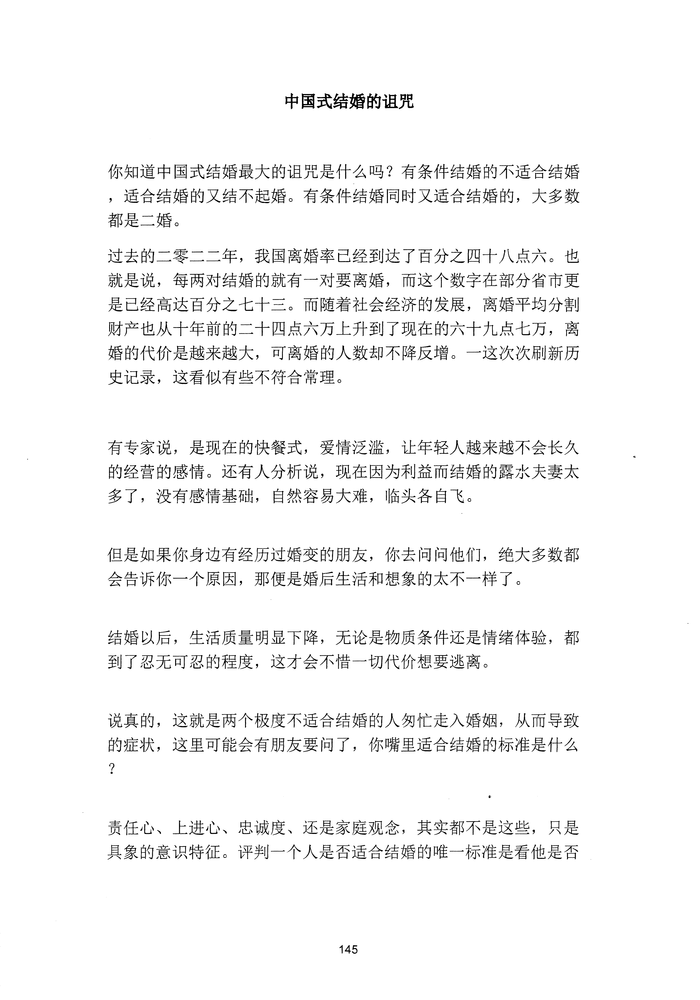
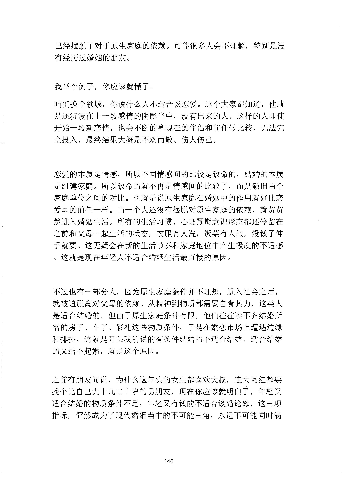
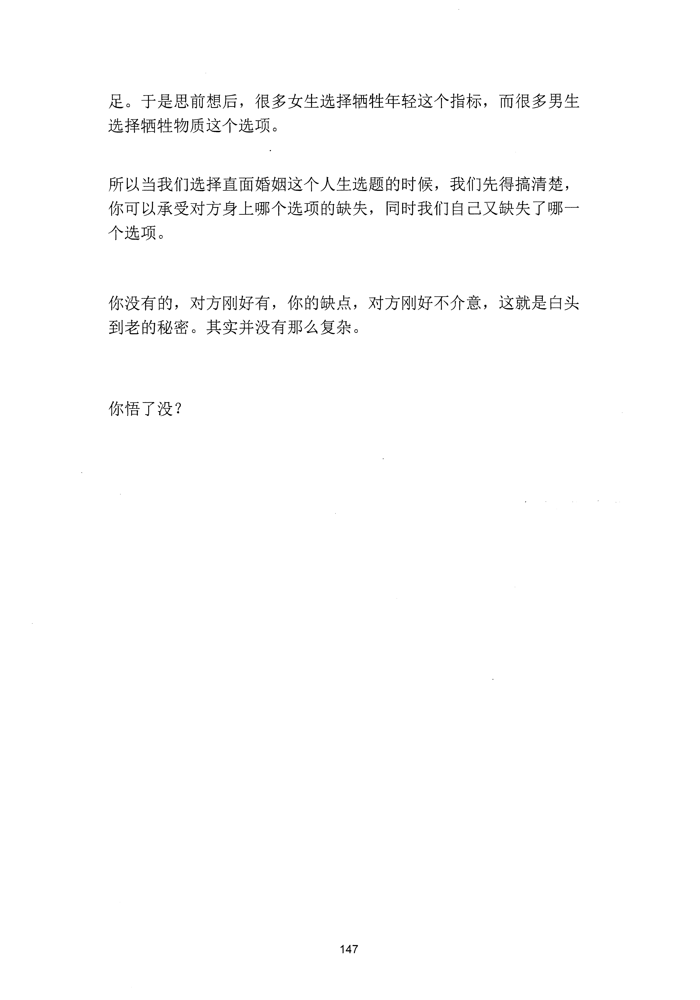

<!-- 原书第 153 页 -->

# 中国式结婚的诅咒

你知道中国式结婚最大的诅咒是什么吗？有条件结婚的不适合结婚，适合结婚的又结不起婚。有条件结婚同时又适合结婚的，大多数都是二婚。过去的二零二二年，我国离婚率已经到达了百分之四十八点六。也就是说，每两对结婚的就有一对要离婚，而这个数字在部分省市更是已经高达百分之七十三。而随着社会经济的发展，离婚平均分割财产也从十年前的二十四点六万上升到了现在的六十九点七万，离婚的代价是越来越大，可离婚的人数却不降反增。一这次次刷新历史记录，这看似有些不符合常理。

有专家说，是现在的快餐式，爱情泛滥，让年轻人越来越不会长久的经营的感情。还有人分析说，现在因为利益而结婚的露水夫妻太多了，没有感情基础，自然容易大难，临头各自飞。

但是如果你身边有经历过婚变的朋友，你去问问他们，绝大多数都会告诉你一个原因，那便是婚后生活和想象的太不一样了。

结婚以后，生活质量明显下降，无论是物质条件还是情绪体验，都到了忍无可忍的程度，这才会不惜一切代价想要逃离。

说真的，这就是两个极度不适合结婚的人匆忙走入婚姻，从而导致的症状，这里可能会有朋友要问了，你嘴里适合结婚的标准是什么？

责任心、上进心、忠诚度、还是家庭观念，其实都不是这些，只是具象的意识特征。评判一个人是否适合结婚的唯一标准是看他是否

<!-- source-image-start -->

查看原书第 153 页影像

<!-- source-image-end -->
<!-- 原书第 154 页 -->

已经摆脱了对于原生家庭的依赖。可能很多人会不理解，特别是没有经历过婚姻的朋友。

我举个例子，你应该就懂了。咱们换个领域，你说什么人不适合谈恋爱。这个大家都知道，他就是还沉浸在上一段感情的阴影当中，没有出来的人。这样的人即使开始一段新恋情，也会不断的拿现在的伴侣和前任做比较，无法完全投入，最终结果大概是不欢而散、伤人伤已。

恋爱的本质是情感，所以不同情感间的比较是致命的，结婚的本质是组建家庭。所以致命的就不再是情感间的比较了，而是新旧两个家庭单位之间的对比。也就是说原生家庭在婚姻中的作用就好比恋爱里的前任一样。当一个人还没有摆脱对原生家庭的依赖，就贸贸然进入婚烟生活。所有的生活习惯、心理预期意识形态都还停留在之前和父母一起生活的状态，衣服有人洗，饭菜有人做，没钱了伸手就要。这无疑会在新的生活节奏和家庭地位中产生极度的不适感。这就是现在年轻人不适合婚姻生活最直接的原因。

不过也有一部分人，因为原生家庭条件并不理想，进入社会之后，就被迫脱离对父母的依赖。从精神到物质都需要自食其力，这类人是适合结婚的。但由于原生家庭条件有限，他们往往凑不齐结婚所需的房子、车子、彩礼这些物质条件，于是在婚恋市场上遭遇边缘和排挤，这就是开头我所说的有条件结婚的不适合结婚，适合结婚的又结不起婚，就是这个原因。

之前有朋友问说，为什么这年头的女生都喜欢大叔，连大网红都要找个比自己大十几二十岁的男朋友，现在你应该就明白宁，年轻又适合结婚的物质条件不足，年轻又有钱的不适合谈婚论嫁，这三项指标，俨然成为了现代婚姻当中的不可能三角，永远不可能同时满

<!-- source-image-start -->

查看原书第 154 页影像

<!-- source-image-end -->
<!-- 原书第 155 页 -->

足。于是思前想后，很多女生选择牺牲年轻这个指标，而很多男生选择牺牲物质这个选项。

所以当我们选择直面婚姻这个人生选题的时候，我们先得搞清楚，你可以承受对方身上哪个选项的缺失，同时我们自己又缺失了哪一个选项。

你没有的，对方刚好有，你的缺点，对方刚好不介意，这就是白头到老的秘密。其实并没有那么复杂。

你悟了没？

<!-- source-image-start -->

查看原书第 155 页影像

<!-- source-image-end -->
