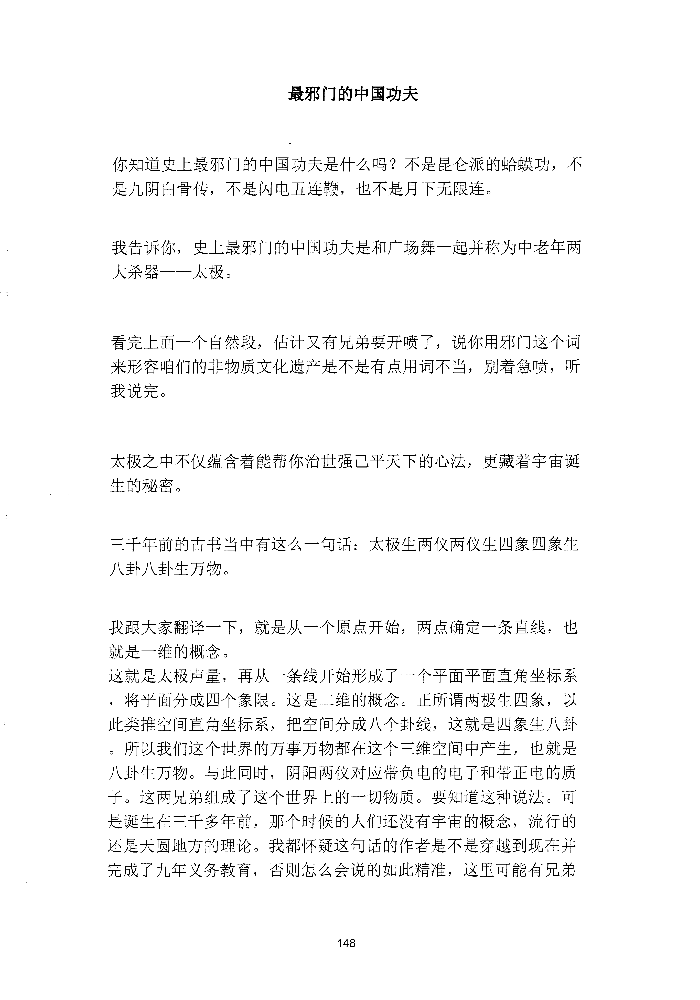
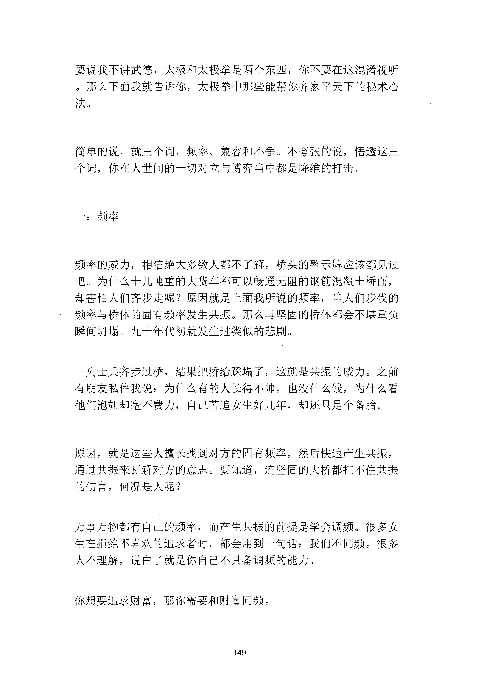
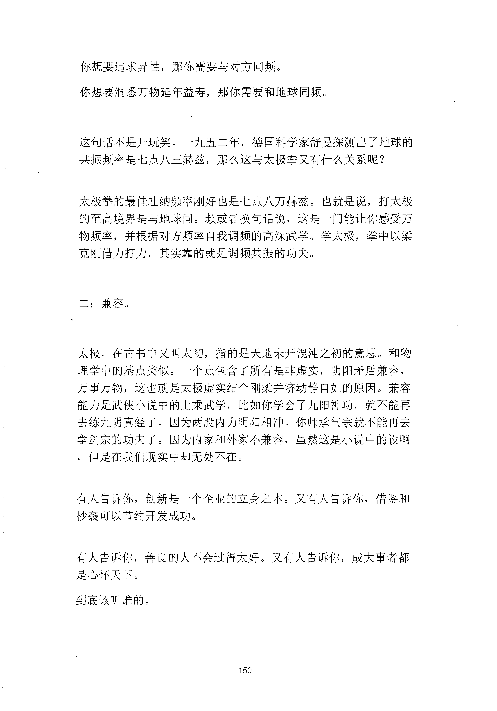
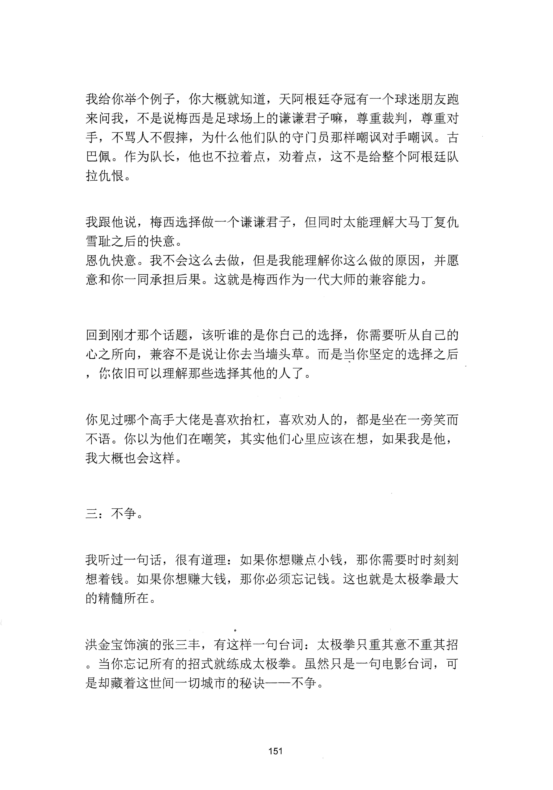
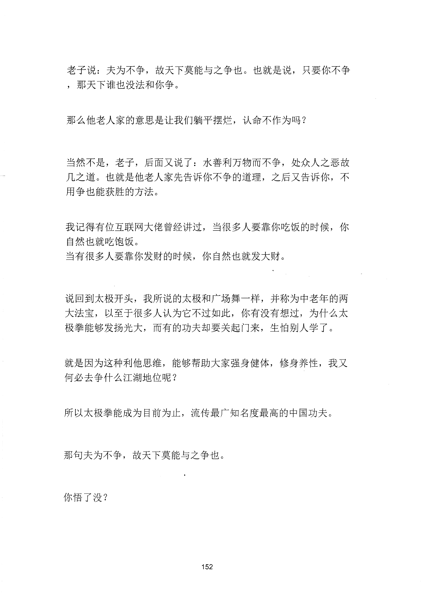

<!-- 原书第 156 页 -->

# 最邪门的中国功夫

你知道史上最邪门的中国功夫是什么吗？不是昆仑派的蛉蟆功，不
是九阴白骨传，不是闪电五连鞭，也不是月下无限连。
我告诉你，史上最邪门的中国功夫是和广场舞一起并称为中老年两
大杀器一一太极。
看完上面一个自然段，估计又有兄弟要开喷了，说你用邪门这个词
来形容咱们的非物质文化遗产是不是有点用词不当，别着急喷，听
我说完。
太极之中不仅蕴含着能帮你治世强已平天下的心法，更藏着宇宙诞
生的秘密。
三千年前的古书当中有这么一句话：太极生两仪两仪生四象四象生
八卦八卦生万物。
我跟大家翻译一下，就是从一个原点开始，两点确定一条直线，也
就是一维的概念。
这就是太极声量，再从一条线开始形成了一个平面平面直角坐标系
，将平面分成四个象限。这是二维的概念。正所谓两极生四象，以
此类推空间直角坐标系，把空间分成八个卦线，这就是四象生八卦
。所以我们这个世界的万事万物都在这个三维空间中产生，也就是
八卦生万物。与此同时，阴阳两仪对应带负电的电子和带正电的质
子。这两兄弟组成了这个世界上的一切物质。要知道这种说法。可
是诞生在三千多年前，那个时候的人们还没有宇宙的概念，流行的
还是天圆地方的理论。我都怀疑这句话的作者是不是穿越到现在并
完成了九年义务教育，否则怎么会说的如此精准，这里可能有兄弟
148
更多kr66e9gs

<!-- source-image-start -->

查看原书第 156 页影像

<!-- source-image-end -->

<!-- 原书第 157 页 -->

要说我不讲武德，太极和太极拳是两个东西，你不要在这混淆视听
。那么下面我就告诉你，太极拳中那些能帮你齐家平天下的秘术心
法。
简单的说，就三个词，频率、兼容和不争。不夸张的说，悟透这三
个词，你在人世间的一切对立与博弈当中都是降维的打击。
一：频率。
频率的威力，相信绝大多数人都不了解，桥头的警示牌应该都见过
吧。为什么十几吨重的大货车都可以畅通无阻的钢筋混凝土桥面，
却害怕人们齐步走呢？原因就是上面我所说的频率，当人们步伐的
频率与桥体的固有频率发生共振。那么再坚固的桥体都会不堪重负
瞬间坰塌。九十年代初就发生过类似的悲剧。
一列士兵齐步过桥，结果把桥给踩塌了，这就是共振的威力。之前
有朋友私信我说：为什么有的人长得不帅，也没什么钱，为什么看
他们泡妞却毫不费力，自己苦追女生好几年，却还只是个备胎。
原因，就是这些人擅长找到对方的固有频率，然后快速产生共振，
通过共振来瓦解对方的意志。要知道，连坚固的大桥都扛不住共振
的伤害，何况是人呢？
万事万物都有自己的频率，而产生共振的前提是学会调频。很多女
生在拒绝不喜欢的追求者时，都会用到一句话：我们不同频。很多
人不理解，说臼了就是你自己不具备调频的能力。
你想要追求财富，那你需要和财富同频。
149
更多kr66e9gs

<!-- source-image-start -->

查看原书第 157 页影像

<!-- source-image-end -->

<!-- 原书第 158 页 -->

你想要追求异性，那你需要与对方同频。
你想要洞悉万物延年益寿，那你需要和地球同频。
这句话不是开玩笑。一九五二年，德国科学家舒曼探测出了地球的
共振频率是七点八三赫兹，那么这与太极拳又有什么关系呢？
太极拳的最佳吐纳频率刚好也是七点八万赫兹。也就是说，打太极
的至高境界是与地球同。频或者换旬话说，这是一门能让你感受万
物频率，并根据对方频率自我调频的高深武学。学太极，拳中以柔
克刚借力打力，其实靠的就是调频共振的功夫。
二：兼容。
太极。在古书中又叫太初，指的是天地未开混沌之初的意思。和物
理学中的基点类似。一个点包含了所有是非虚实，阴阳矛盾兼容，
万事万物，这也就是太极虚实结合刚柔并济动静自如的原因。兼容
能力是武侠小说中的上乘武学，比如你学会了九阳神功，就不能再
去练九阴真经了。因为两股内力阴阳相冲。你师承气宗就不能再去
学剑宗的功夫了。因为内家和外家不兼容，虽然这是小说中的设啊
，但是在我们现实中却无处不在。
有人告诉你，创新是一个企业的立身之本。又有人告诉你，借鉴和
抄袭可以节约开发成功。
有人告诉你，善良的人不会过得太好。又有人告诉你，成大事者都
是心怀天下。
到底该听谁的。
150
更多kr66e9gs

<!-- source-image-start -->

查看原书第 158 页影像

<!-- source-image-end -->

<!-- 原书第 159 页 -->

我给你举个例子，你大概就知道，天阿根廷夺冠有一个球迷朋友跑
来问我，不是说梅西是足球场上的谦谦君子嘛，尊重裁判，尊重对
手，不骂人不假摔，为什么他们队的守门员那样嘲讽对手嘲讽。古
巴佩。作为队长，他也不拉着点，劝着点，这不是给整个阿根廷队
拉仇恨。
我跟他说，梅西选择做一个谦谦君子，但同时太能理解大马丁复仇
雪耻之后的快意。
恩仇快意。我不会这么去做，但是我能理解你这么做的原因，并愿
意和你一同承担后果。这就是梅西作为一代大师的兼容能力。
回到刚才那个话题，该听谁的是你白己的选择，你需要听从自己的
心之所向，兼容不是说让你去当墙头草。而是当你坚定的选择之后
，你依旧可以理解那些选择其他的人了。
你见过哪个高手大佬是喜欢抬杠，喜欢劝人的，都是坐在一旁笑而
不语。你以为他们在嘲笑，其实他们心里应该在想，如果我是他，
我大概也会这样。
三：不争。
我听过一旬话，很有道理：如果你想赚点小钱，那你需要时时刻刻
想着钱。如果你想赚大钱，那你必须忘记钱。这也就是太极拳最大
的精髓所在。
洪金宝饰演的张三丰，有这样一句台词：太极拳只重其意不重其招
。当你忘记所有的招式就练成太极拳。虽然只是一句电影台词，可
是却藏着这世间一切城市的秘诀——不争。
151
更多kr66e9gs

<!-- source-image-start -->

查看原书第 159 页影像

<!-- source-image-end -->

<!-- 原书第 160 页 -->

老子说：夫为不争，故天下莫能与之争也。也就是说，只要你不争
，那天下谁也没法和你争。
那么他老人家的意思是让我们躺平摆烂，认命不作为吗？
当然不是，老子，后面又说了：水善利万物而不争，处众入之恶故
几之道。也就是他老人家先告诉你不争的道理，之后又告诉你，不
用争也能获胜的方法。
我记得有位互联网大佬曾经讲过，当很多人要靠你吃饭的时候，你
自然也就吃饱饭。
当有很多人要靠你发财的时候，你自然也就发大财。
说回到太极开头，我所说的太极和广场舞一样，并称为中老年的两
大法宝，以至于很多人认为它不过如此，你有没有想过，为什么太
极拳能够发扬光大，而有的功夫却要关起门来，生怕别人学了。
就是因为这种利他思维，能够帮助大家强身健体，修身养性，我又
何必去争什么江湖地位呢？
所以太极拳能成为目前为止，流传最广知名度最高的中国功夫。
那旬夫为不争，故天下莫能与之争也。
你悟了没？
152
更多kr66e9gs

<!-- source-image-start -->

查看原书第 160 页影像

<!-- source-image-end -->
