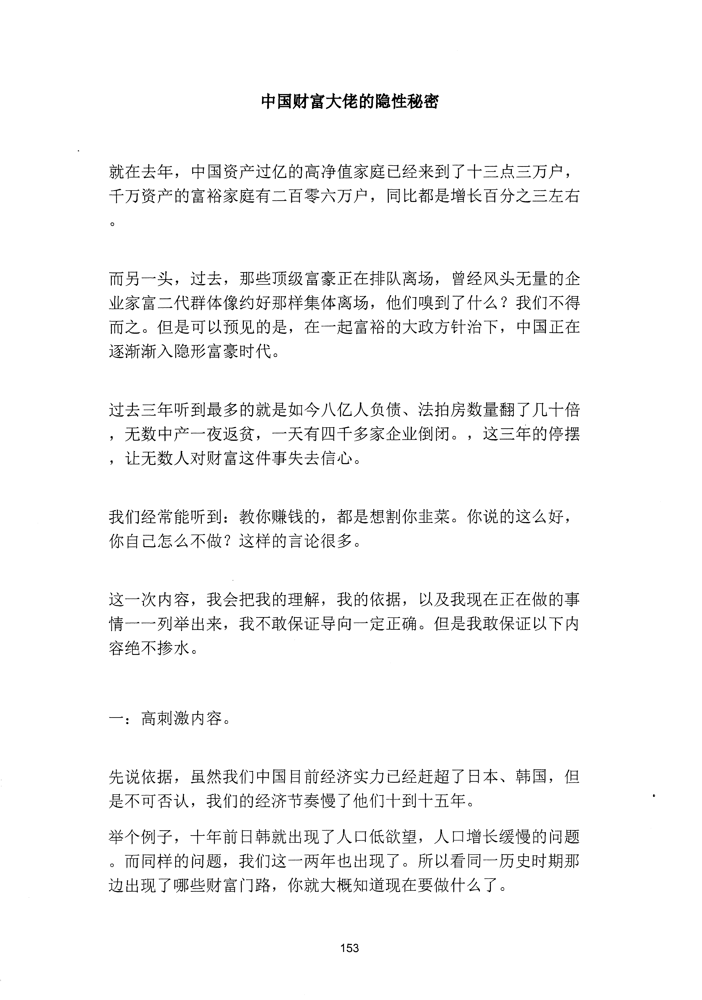
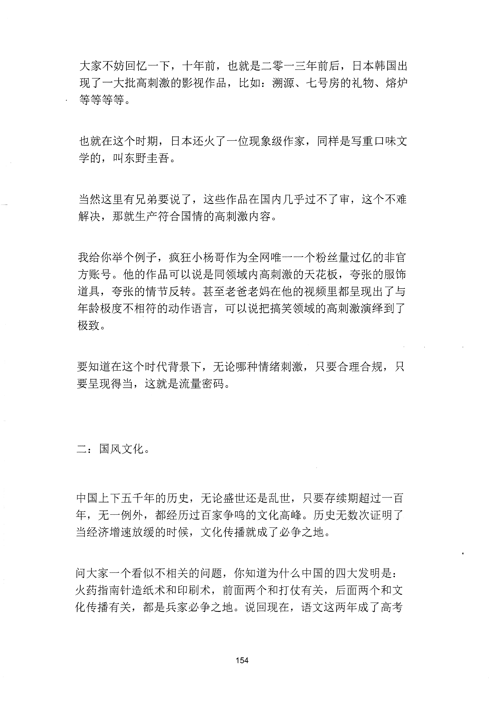
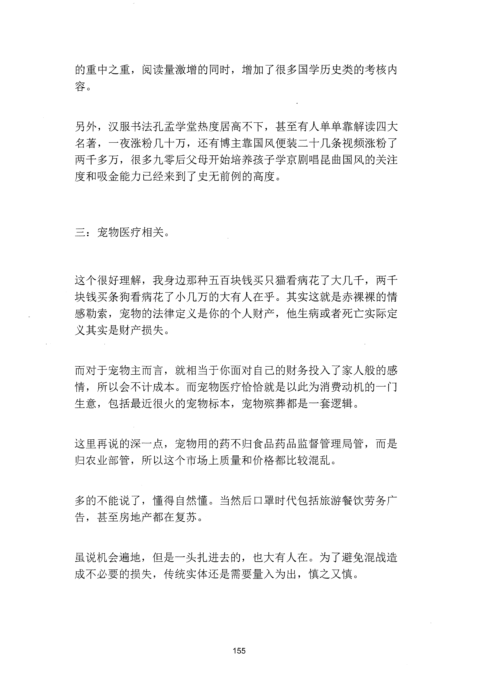
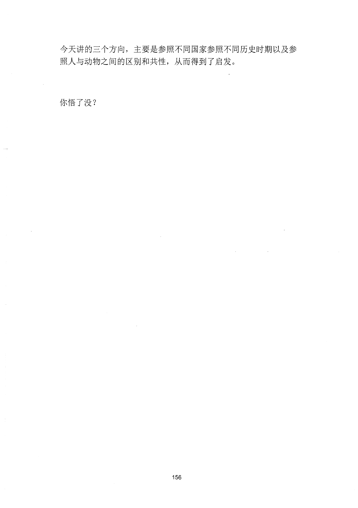

<!-- 原书第 161 页 -->

# 中国财富大佬的隐性秘密

就在去年，中国资产过亿的高净值家庭已经来到了十三点三万户，
千万资产的富裕家庭有二百零六万户，同比都是增长百分之三左右
而另一头，过去，那些顶级富豪正在排队离场，曾经风头无量的企
业家富二代群体像约好那样集体离场，他们嗅到了什么？我们不得
而之。但是可以预见的是，在一起富裕的大政方针治下，中国正在
逐渐渐入隐形富豪时代。
过去三年听到最多的就是如今八亿人负债、法拍房数量翻了几十倍
，无数中产一夜返贫，一天有四千多家企业倒闭。，这三年的停摆
，让无数人对财富这件事失去信心。
我们经常能听到：教你赚钱的，都是想割你韭菜。你说的这么好，
你自己怎么不做？这样的言论很多。
这一次内容，我会把我的理解，我的依据，以及我现在正在做的事
情一一列举出来，我不敢保证导向一定正确。但是我敢保证以下内
容绝不掺水。
一：高刺激内容。
先说依据，虽然我们中国目前经济实力已经赶超了日本、韩国，但
是不可否认，我们的经济节奏慢了他们十到十五年。
举个例子，十年前日韩就出现了人口低欲望，人口增长缓慢的问题
。而同样的问题，我们这一两年也出现了。所以看同一历史时期那
边出现了哪些财富门路，你就大概知道现在要做什么了。
153
更多kr66e9gs

<!-- source-image-start -->

查看原书第 161 页影像

<!-- source-image-end -->

<!-- 原书第 162 页 -->

大家不妨回忆一下，十年前，也就是二零一三年前后，日本韩国出
现了一大批高刺激的影视作品，比如：溯源、七号房的礼物、熔炉
等等等等。
也就在这个时期，日本还火了一位现象级作家，同样是写重口味文
学的，叫东野圭吾。
当然这里有兄弟要说了，这些作品在国内几乎过不了审，这个不难
解决，那就生产符合国情的高刺激内容。
我给你举个例子，疯狂小杨哥作为全网唯一一个粉丝量过亿的非官
方账号。他的作品可以说是同领域内高刺激的天花板，夸张的服饰
道具，夸张的情节反转。甚至老爸老妈在他的视频里都呈现出了与
年龄极度不相符的动作语言，可以说把搞笑领域的高刺激演绎到了
极致。
要知道在这个时代背景下，无论哪种情绪刺激，只要合理合规，只
要呈现得当，这就是流量密码。
二：国风文化。
中国上下五千年的历史，无论盛世还是乱世，只要存续期超过一百
年，无一例外，都经历过百家争鸣的文化高峰。历史无数次证明了
当经济增速放缓的时候，文化传播就成了必争之地。
问大家一个看似不相关的问题，你知道为什么中国的四大发明是：
火药指南针造纸术和印刷术，前面两个和打仗有关，后面两个和文
化传播有关，都是兵家必争之地。说回现在，语文这两年成了高考
154
更多kr66e9gs

<!-- source-image-start -->

查看原书第 162 页影像

<!-- source-image-end -->

<!-- 原书第 163 页 -->

的重中之重，阅读量激增的同时，增加了很多国学历史类的考核内
容。
另外，汉服书法孔孟学堂热度居高不下，甚至有人单单靠解读四大
名著，一夜涨粉几十万，还有博主靠国风便装二十几条视频涨粉了
两千多万，很多九零后父母开始培养孩子学京剧唱昆曲国风的关注
度和吸金能力已经来到了史无前例的高度。
三：宠物医疗相关。
这个很好理解，我身边那种五百块钱买只猫看病花了大几千，两千
块钱买条狗看病花了小几万的大有人在乎。其实这就是赤裸裸的清
感勒索，宠物的法律定义是你的个人财产，他生病或者死亡实际定
义其实是财产损失。
而对于宠物主而言，就相当于你面对自己的财务投入了家入般的感
情，所以会不计成本。而宠物医疗恰恰就是以此为消费动机的一门
生意，包括最近很火的宠物标本，宠物殡葬都是一套逻辑。
这里再说的深一点，宠物用的药不归食品药品监督管理局管，而是
归农业部管，所以这个市场上质量和价格都比较混乱。
多的不能说了，懂得自然懂。当然后口罩时代包括旅游餐饮劳务广
告，甚至房地产都在复苏。
虽说机会遍地，但是一头扎进去的，也大有人在。为了避免混战造
成不必要的损失，传统实体还是需要量入为出，慎之又慎。
155
更多kr66e9gs

<!-- source-image-start -->

查看原书第 163 页影像

<!-- source-image-end -->

<!-- 原书第 164 页 -->

今天讲的三个方向，主要是参照不同国家参照不同历史时期以及参
照人与动物之间的区别和共性，从而得到了启发。
你悟了没？
156
更多kr66e9gs

<!-- source-image-start -->

查看原书第 164 页影像

<!-- source-image-end -->
