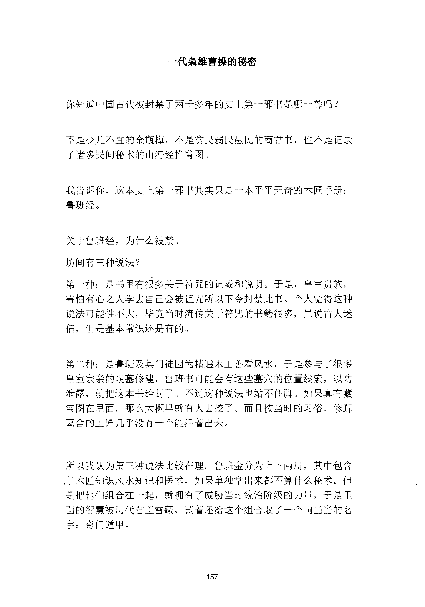
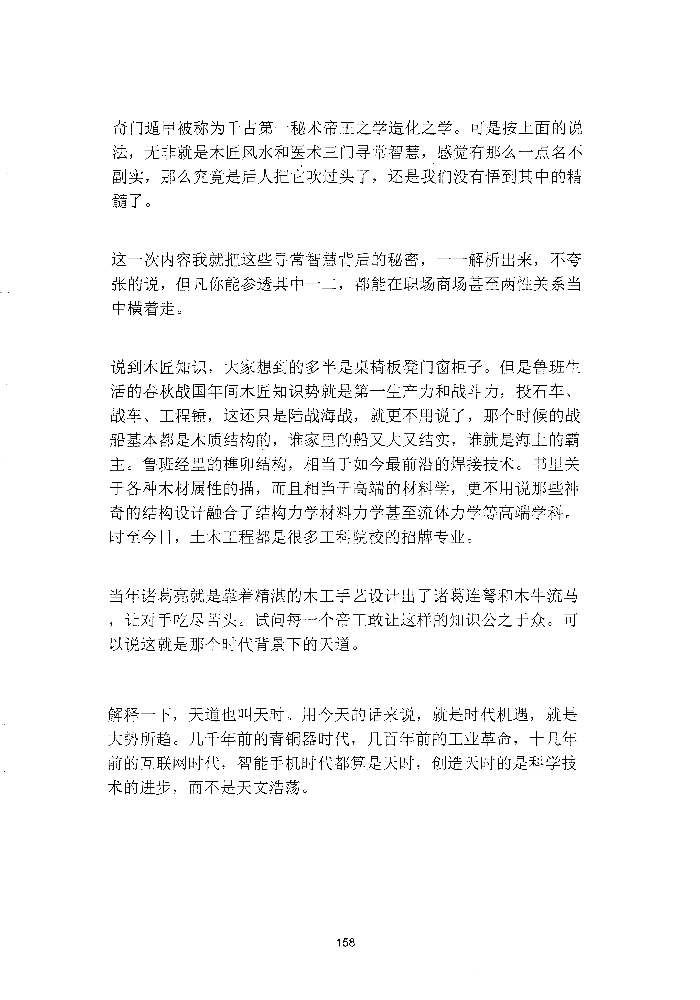
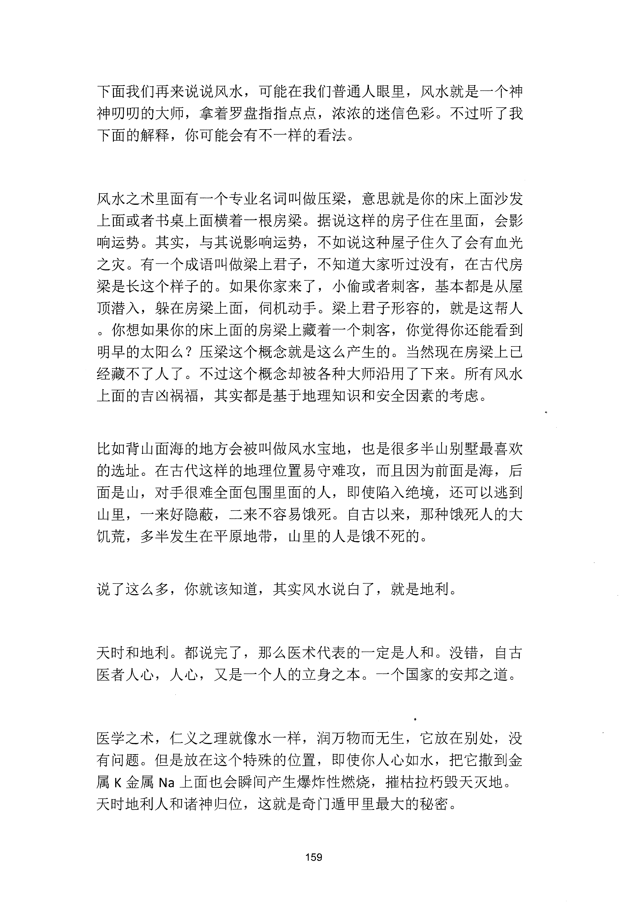
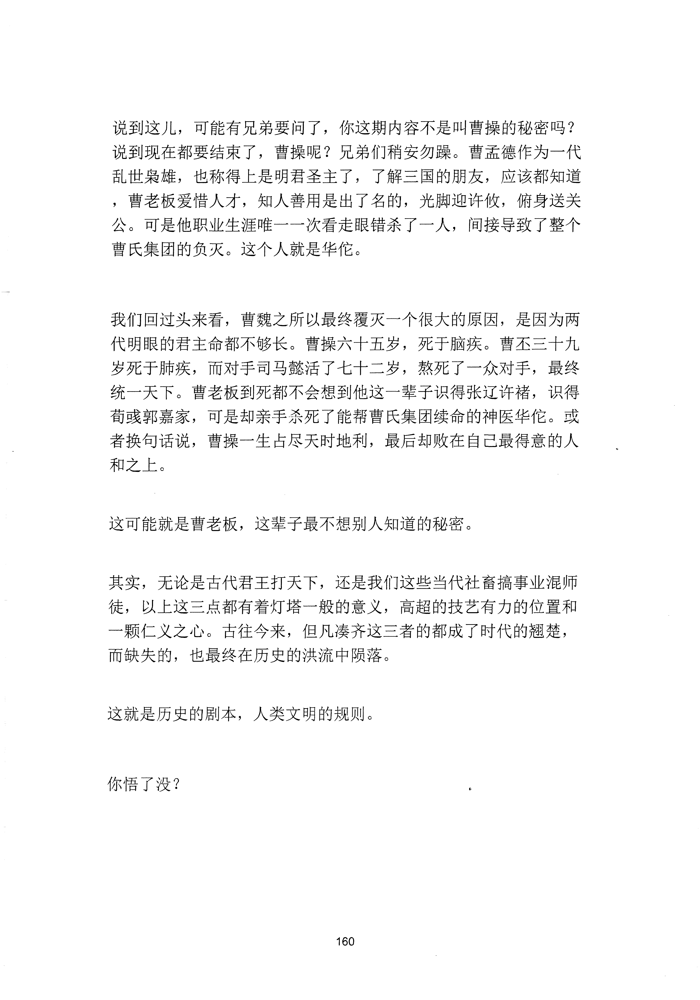

<!-- 原书第 165 页 -->

# 一代枭雄曹操的秘密

你知道中国古代被封禁了两于多年的史上第一邪书是哪一部吗？

不是少儿不宜的金瓶梅，不是贫民弱民愚民的商君书，也不是记录了诸多民间秘术的山海经推背团。

我告诉你，这本史上第一邪书其实只是一本平平无奇的木匠手册：鲁班经。

关于鲁班经，为什么被禁。坊间有三种说法？第一种：是书里有很多关于符咒的记载和说明。于是，皇室贵族，害怕有心之人学去自己会被诅咒所以下令封禁此书。个人觉得这种说法可能性不大，毕竟当时流传关于符咒的书籍很多，虽说古人迷信，但是基本常识还是有的。

第二种：是鲁班及其门徒因为精通木工善看风水，于是参与了很多皇室宗亲的陵墓修建，鲁班书可能会有这些墓穴的位置线索，以防泄露，就把这本书给封了。不过这种说法也站不住脚。如果真有藏宝图在里面，那么大概早就有人去挖了。而且按当时的习俗，修蚌墓舍的工匠几乎没有一个能活着出来。

所以我认为第三种说法比较在理。鲁班金分为上下两册，其中包含｀了木匠知识风水知识和医术，如果单独拿出来都不算什么秘术。但是把他们组合在一起，就拥有了威胁当时统治阶级的力量，于是里面的智慧被历代君王雪藏，试着还给这个组合取了一个响当当的名字：奇门遁甲。

<!-- source-image-start -->

查看原书第 165 页影像

<!-- source-image-end -->
<!-- 原书第 166 页 -->

奇门遁甲被称为于古第一秘术帝王之学造化之学。可是按上面的说法，无非就是木匠风水和医术三门寻常智慧，感觉有那么一点名不副实，那么究竟是后人把它吹过头了，还是我们没有悟到其中的精髓了。

这一次内容我就把这些寻常智慧背后的秘密，一一解析出来，不夸张的说，但凡你能参透其中一二，都能在职场商场甚至两性关系当中横着走。

说到木匠知识，大家想到的多半是桌椅板凳门窗柜子。但是鲁班生活的春秋战国年间木匠知识势就是第一生产力和战斗力，投石车、战车、工程锤，这还只是陆战海战，就更不用说了，那个时候的战船基本都是木质结构的，谁家里的船又大又结实，谁就是海上的霸主。鲁班经皇的椎卯结构，相当于如今最前沿的焊接技术。书里关于各种木材属性的描，而且相当于高端的材料学，更不用说那些神奇的结构设计融合了结构力学材料力学甚至流体力学等高端学科。时至今曰，土木工程都是很多工科院校的招牌专业。

当年诸葛亮就是靠着精湛的木工手艺设计出了诸葛连弩和木牛流马，让对手吃尽苦头。试问每一个帝王敢让这样的知识公之于众。可以说这就是那个时代背景下的天道。

解释一下，天道也叫天时。用今天的话来说，就是时代机遇，就是大势所趋。几千年前的青铜器时代，几百年前的工业革命，十几年前的互联网时代，智能手机时代都算是天时，创造天时的是科学技术的进步，而不是天文浩荡。

<!-- source-image-start -->

查看原书第 166 页影像

<!-- source-image-end -->
<!-- 原书第 167 页 -->

下面我们再来说说风水，可能在我们普通人眼里，风水就是一个神神叨叨的大师，拿着罗盘指指点点，浓浓的迷信色彩。不过听了我下面的解释，你可能会有不一样的看法。

风水之术里面有一个专业名词叫做压梁，意思就是你的床上面沙发上面或者书桌上面横着一根房梁。据说这样的房子住在里面，会影响运势。其实，与其说影响运势，不如说这种屋子住久了会有血光之灾。有一个成语叫做梁上君子，不知道大家听过没有，在古代房梁是长这个样子的。如果你家来了，小偷或者刺客，基本都是从屋顶潜入，躲在房梁上面，伺机动手。梁上君子形容的，就是这帮人。你想如果你的床上面的房梁上藏着一个刺客，你觉得你还能看到明早的太阳么？压梁这个概念就是这么产生的。当然现在房梁上已经藏不了人了。不过这个概念却被各种大师沿用了下来。所有风水上面的吉凶祸福，其实都是基于地理知识和安全因素的考虑。

比如背山面海的地方会被叫做风水宝地，也是很多半山别墅最喜欢的选址。在古代这样的地理位置易守难攻，而且因为前面是海，后面是山，对手很难全面包围里面的人，即使陷入绝境，还可以逃到山里，一来好隐蔽，二来不容易饿死。自古以来，那种饿死人的大饥荒，多半发生在平原地带，山里的人是饿不死的。

说了这么多，你就该知道，其实风水说白了，就是地利。

天时和地利。都说完了，那么医术代表的一定是人和。没错，自古医者人心，人心，又是一个人的立身之本。一个国家的安邦之道。

医学之术，仁义之理就像水一样，润万物而无生，它放在别处，没有问题。但是放在这个特殊的位置，即使你人心如水，把它撒到金属K 金属Na 上面也会瞬间产生爆炸性燃烧，摧枯拉朽毁夭灭地。天时地利人和诸神归位，这就是奇门遁甲里最大的秘密。

<!-- source-image-start -->

查看原书第 167 页影像

<!-- source-image-end -->
<!-- 原书第 168 页 -->

说到这儿，可能有兄弟要问了，你这期内容不是叫曹操的秘密吗？说到现在都要结束了，曹操呢？兄弟们稍安勿躁。曹孟德作为一代乱世枭雄，也称得上是明君圣主了，了解三国的朋友，应该都知道，曹老板爱惜人才，知人善用是出了名的，光脚迎许攸，俯身送关公。可是他职业生涯唯一一次看走眼错杀了一人，间接导致了整个曹氏集团的负灭。这个人就是华佗。

我们回过头来看，曹魏之所以最终覆灭一个很大的原因，是因为两代明眼的君主命都不够长。曹操六十五岁，死于脑疾。曹丕三十九岁死于肺疾，而对手司马懿活了七十二岁，熬死了一众对手，最终统一天下。曹老板到死都不会想到他这一辈子识得张辽许褚，识得荀残郭嘉家，可是却亲手杀死了能帮曹氏集团续命的神医华佗。或者换句话说，曹操一生占尽天时地利，最后却败在自己最得意的人和之上。

这可能就是曹老板，这辈子最不想别人知道的秘密。

其实，无论是古代君王打天下，还是我们这些当代社畜搞事业混师徒，以上这三点都有着灯塔一般的意义，高超的技艺有力的位置和一颗仁义之心。古往今来，但凡凑齐这三者的都成了时代的翘楚，而缺失的，也最终在历史的洪流中陨落。

这就是历史的剧本，人类文明的规则。

你悟了没？

<!-- source-image-start -->

查看原书第 168 页影像

<!-- source-image-end -->
