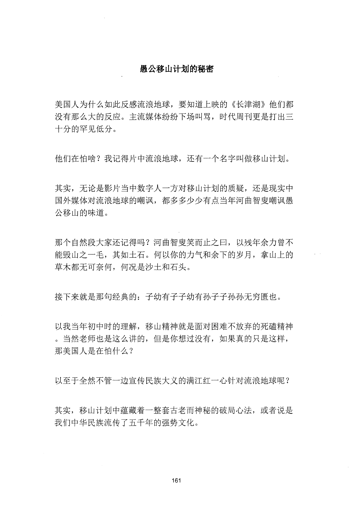
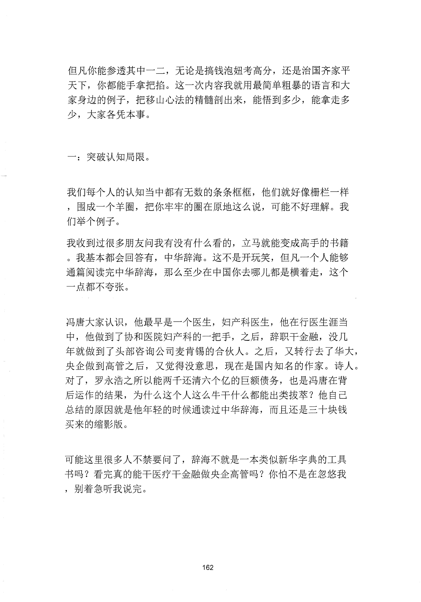
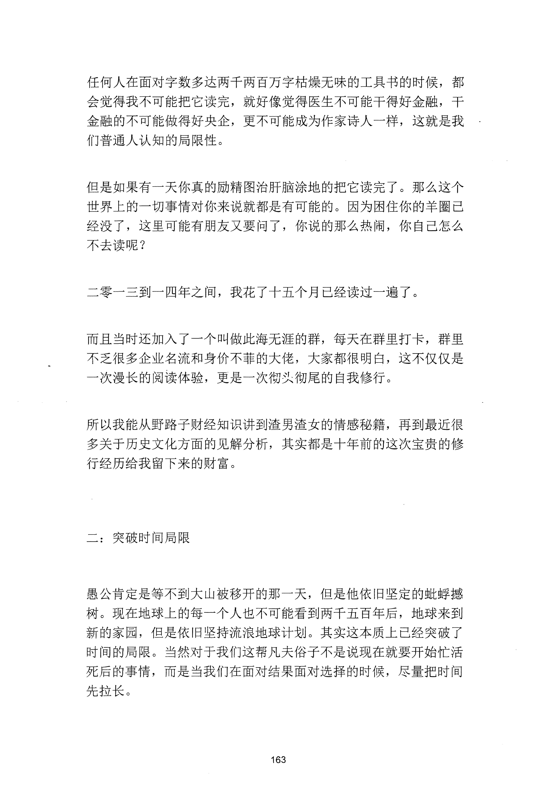
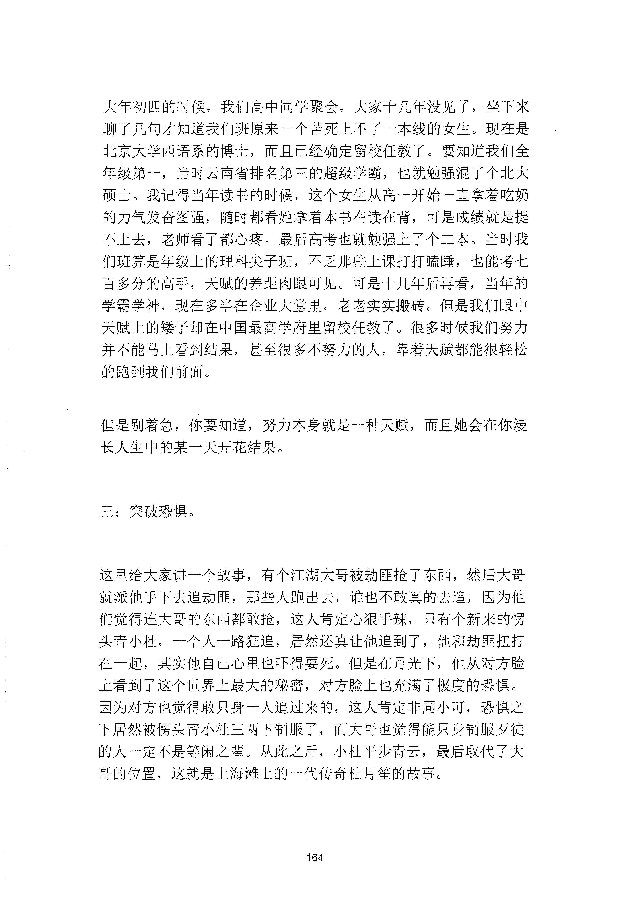
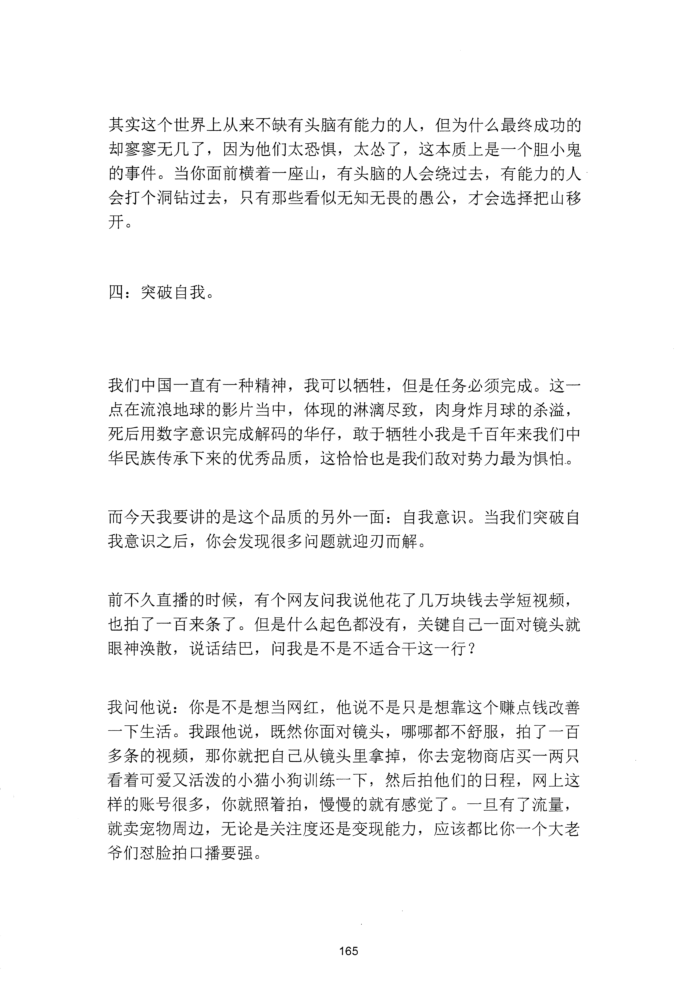
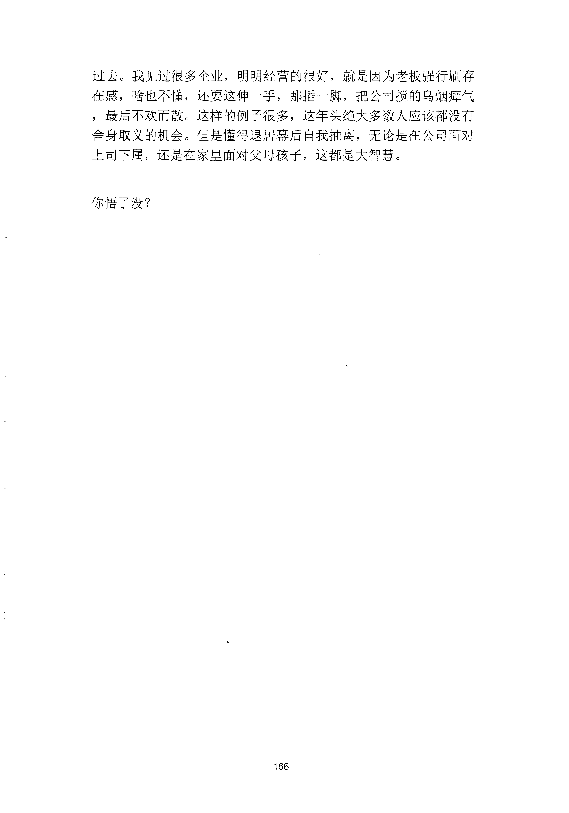

<!-- 原书第 169 页 -->

# 愚公移山计划的秘密

美国人为什么如此反感流浪地球，要知道上映的《长津湖》他们都
没有那么大的反应。主流媒体纷纷下场叫骂，时代周刊更是打出三
十分的罕见低分。
他们在怕啥？我记得片中流浪地球，还有一个名字叫做移山计划。
其实，无论是影片当中数字人一方对移山计划的质疑，还是现实中
国外媒体对流浪地球的嘲讽，都多多少少有点当年河曲智叟嘲讽愚
公移山的味道。
那个自然段大家还记得吗？河曲智叟笑而止之曰，以残年余力曾不
能毁山之一毛，其如土石。何以你的力气和余下的岁月，拿山上的
草木都无可奈何，何况是沙土和石头。
接下来就是那句经典的：子幼有子子幼有孙子子孙孙无穷匮也。
以我当年初中时的理解，移山精神就是面对困难不放弃的死磕精神
。当然老师也是这么讲的，但是你想过没有，如果真的只是这样，
那美国人是在怕什么？
以至于全然不管一边宣传民族大义的满江红一心针对流浪地球呢？
其实，移山计划中蕴藏着一整套古老而神秘的破局心法，或者说是
我们中华民族流传了五千年的强势文化。
161
更多kr66e9gs

<!-- source-image-start -->

查看原书第 169 页影像

<!-- source-image-end -->

<!-- 原书第 170 页 -->

但凡你能参透其中一二，无论是搞钱泡妞考高分，还是治国齐家平
天下，你都能手拿把抬。这一次内容我就用最简单粗暴的语言和大
家身边的例子，把移山心法的精髓剖出来，能悟到多少，能拿走多
少，大家各凭本事。
一：突破认知局限。
我们每个人的认知当中都有无数的条条框框，他们就好像栅栏一样
，围成一个羊圈，把你牢牢的圈在原地这么说，可能不好理解。我
们举个例子。
我收到过很多朋友问我有没有什么看的，立马就能变成高手的书籍
。我基本都会回答有，中华辞海。这不是开玩笑，但凡一个人能够
通篇阅读完中华辞海，那么至少在中国你去哪儿都是横着走，这个
一点都不夸张。
冯唐大家认识，他最早是一个医生，妇产科医生，他在行医生涯当
中，他做到了协和医院妇产科的一把手，之后，辞职千金融，没几
年就做到了头部咨询公司麦肯锡的合伙人。之后，又转行去了华大，
央企做到高管之后，又觉得没意思，现在是国内知名的作家。诗人。
对了，罗永浩之所以能两千还清六个亿的巨额债务，也是冯唐在背
后运作的结果，为什么这个人这么牛千什么都能出类拔萃？他自己
总结的原因就是他年轻的时候通读过中华辞海，而且还是三十块钱
买来的缩影版。
可能这里很多人不禁要问了，辞海不就是一本类似新华字典的工具
书吗？看完真的能千医疗千金融做央企高管吗？你怕不是在忽悠我
，别着急听我说完。
162
更多kr66e9gs

<!-- source-image-start -->

查看原书第 170 页影像

<!-- source-image-end -->

<!-- 原书第 171 页 -->

任何人在面对字数多达两于两百万字枯燥无味的工具书的时候，都
会觉得我不可能把它读完，就好像觉得医生不可能干得好金融，干
金融的不可能做得好央企，更不可能成为作家诗人一样，这就是我
们普通人认知的局限性。
但是如果有一天你真的励精图治肝脑涂地的把它读完了。那么这个
世界上的一切事情对你来说就都是有可能的。因为困住你的羊圈已
经没了，这里可能有朋友又要问了，你说的那么热闹，你自己怎么
不去读呢？
二零一三到一四年之间，我花了十五个月已经读过一遍了。
而且当时还加入了一个叫做此海无涯的群，每天在群里打卡，群里
不乏很多企业名流和身价不菲的大佬，大家都很明白，这不仅仅是
一次漫长的阅读体验，更是一次彻义彻尾的自我修行。
所以我能从野路子财经知识讲到渣男渣女的情感秘籍，再到最近很
多关于历史文化方面的见解分析，其实都是十年前的这次宝贵的修
行经历给我留下来的财富。
二：突破时间局限
愚公肯定是等不到大山被移开的那一天，但是他依旧坚定的蚔蛭撼
树。现在地球上的每一个人也不可能看到两千五百年后，地球来到
新的家园，但是依旧坚持流浪地球计划。其实这本质上已经突破了
时间的局限。当然对于我们这帮凡夫俗子不是说现在就要开始忙活
死后的事情，而是当我们在面对结果面对选择的时候，尽量把时间
先拉长。
163
更多kr66e9gs

<!-- source-image-start -->

查看原书第 171 页影像

<!-- source-image-end -->

<!-- 原书第 172 页 -->

大年初四的时候，我们高中同学聚会，大家十几年没见了，坐下来
聊了几旬才知道我们班原来一个苦死上不了一本线的女生。现在是
北京大学西语系的博士，而且已经确定留校任教了。要知道我们全
年级第一，当时云南省排名第三的超级学霸，也就勉强混了个北大
硕士。我记得当年读书的时候，这个女生从高一开始一直拿着吃奶
的力气发奋图强，随时都看她拿着本书在读在背，可是成绩就是提
不上去，老师看了都心疼。最后高考也就勉强上了个二本。当时我
们班算是年级上的理科尖子班，不乏那些上课打打睦睡，也能考七
百多分的高手，天赋的差距肉眼可见。可是十几年后再看，当年的
学霸学神，现在多半在企业大堂里，老老实实搬砖。但是我们眼中
天赋上的矮子却在中国最高学府里留校任教了。很多时候我们努力
并不能马上看到结果，甚至很多不努力的人，靠着天赋都能很轻松
的跑到我们前面。
但是别着急，你要知道，努力本身就是一种天赋，而且她会在你漫
长人生中的某一天开花结果。
三：突破恐惧。
这里给大家讲一个故事，有个江湖大哥被劫匪抢了东西，然后大哥
就派他手下去追劫匪，那些人跑出去，谁也不敢真的去追，因为他
们觉得连大哥的东西都敢抢，这人肯定心狠手辣，只有个新来的愣
头青小杜，一个人一路狂追，居然还真让他追到了，他和劫匪扭打
在一起，其实他自己心里也吓得要死。但是在月光下，他从对方脸
上看到了这个世界上最大的秘密，对方脸上也充满了极度的恐惧。
因为对方也觉得敢只身一人追过来的，这人肯定非同小可，恐惧之
下居然被愣头青小杜三两下制服了，而大哥也觉得能只身制服歹徒
的人一定不是等闲之辈。从此之后，小杜平步青云，最后取代了大
哥的位置，这就是上海滩上的一代传奇杜月笙的故事。
164
更多kr66e9gs

<!-- source-image-start -->

查看原书第 172 页影像

<!-- source-image-end -->

<!-- 原书第 173 页 -->

其实这个世界上从来不缺有头脑有能力的人，但为什么最终成功的
却寥寥无几了，因为他们太恐惧，太怂了，这本质上是一个胆小鬼
的事件。当你面前横着一座山，有头脑的人会绕过去，有能力的人
会打个洞钻过去，只有那些看似无知无畏的愚公，才会选择把山移
开。
四：突破自我。
我们中国一直有一种精神，我可以牺牲，但是任务必须完成。这一
点在流浪地球的影片当中，体现的淋漓尽致，肉身炸月球的杀溢，
死后用数字意识完成解码的华仔，敢千牺牲小我是千百年来我们中
华民族传承下来的优秀品质，这恰恰也是我们敌对势力最为惧怕。
而今天我要讲的是这个品质的另外一面：自我意识。当我们突破自
我意识之后，你会发现很多问题就迎刃而解。
前不久直播的时候，有个网友问我说他花了几万块钱去学短视频，
也拍了一百来条了。但是什么起色都没有，关键自己一面对镜头就
眼神涣散，说话结巴，问我是不是不适合于这一行？
我问他说：你是不是想当网红，他说不是只是想靠这个赚点钱改善
一下生活。我跟他说，既然你面对镜头，哪哪都不舒服，拍了一百
多条的视频，那你就把自己从镜头里拿掉，你去宠物商店买一两只
看着可爱又活泼的小猫小狗训练一下，然后拍他们的日程，网上这
样的账号很多，你就照着拍，慢慢的就有感觉了。一旦有了流量，
就卖宠物周边，无论是关注度还是变现能力，应该都比你一个大老
爷们怼脸拍口播要强。
165
更多kr66e9gs

<!-- source-image-start -->

查看原书第 173 页影像

<!-- source-image-end -->

<!-- 原书第 174 页 -->

过去。我见过很多企业，明明经营的很好，就是因为老板强行刷存
在感，啥也不懂，还要这伸一手，那插一脚，把公司搅的乌烟擢气
，最后不欢而散。这样的例子很多，这年头绝大多数人应该都没有
舍身取义的机会。但是懂得退居幕后自我抽离，无论是在公司面对
上司下属，还是在家里面对父母孩子，这都是大智慧。
你悟了没？
166
更多kr66e9gs

<!-- source-image-start -->

查看原书第 174 页影像

<!-- source-image-end -->
