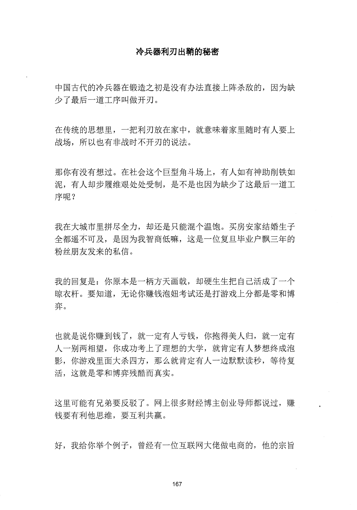
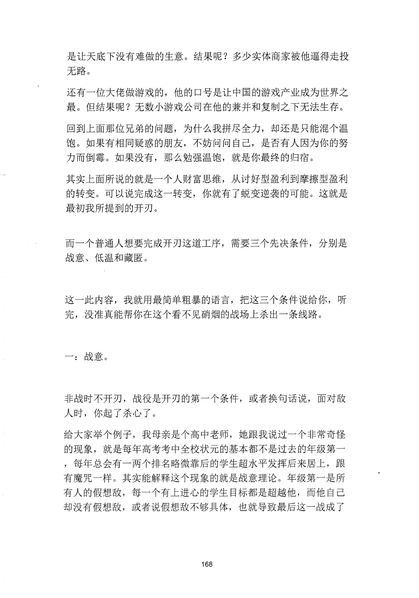
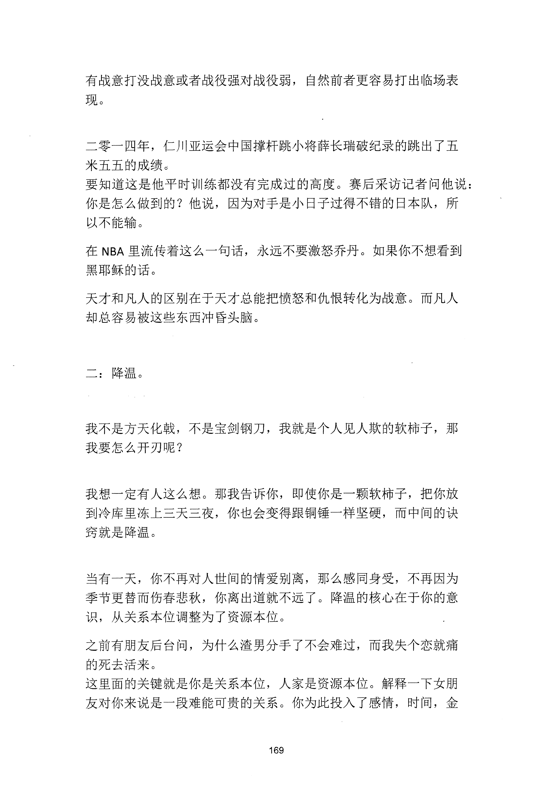
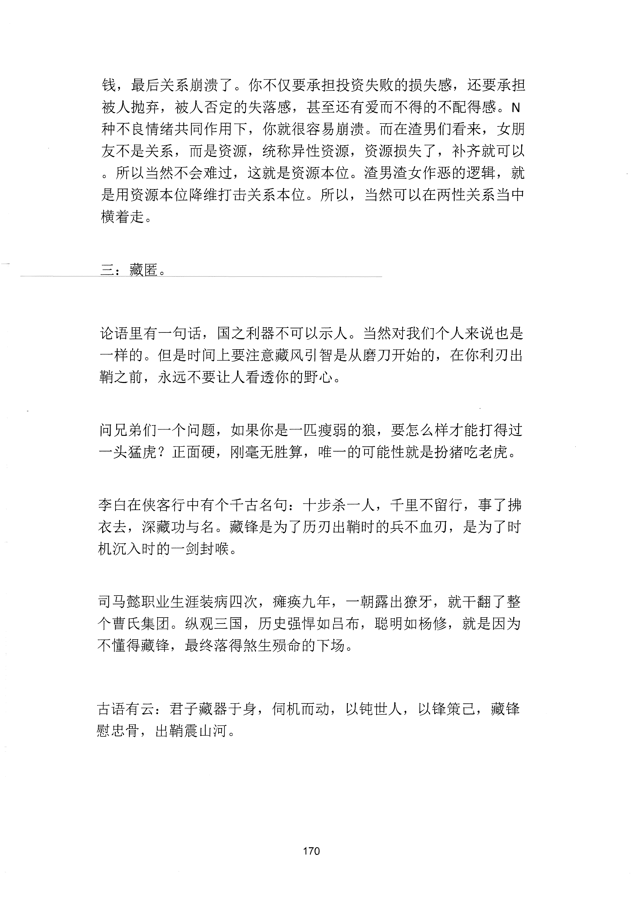

<!-- 原书第 175 页 -->

# 冷兵器利刃出鞘的秘密

中国古代的冷兵器在锻造之初是没有办法直接上阵杀敌的，因为缺
少了最后一道工序叫做开刃。
在传统的思想里，一把利刃放在家中，就意味着家里随时有人要上
战场，所以也有非战时不开刃的说法。
那你有没有想过。在社会这个巨型角斗场上，有人如有神助削铁如
泥，有人却步履维艰处处受制，是不是也因为缺少了这最后一道工
序呢？
我在大城市里拼尽全力，却还是只能混个温饱。买房安家结婚生子
全都遥不可及，是因为我智商低嘛，这是一位复旦毕业户飘三年的
粉丝朋友发来的私信。
我的回复是：你原本是一柄方天画戟，却硬生生把自己活成了一个
隙衣杆。要知道，无论你赚钱泡妞考试还是打游戏上分都是零和博
弈。
也就是说你赚到钱了，就一定有人亏钱，你抱得美人归，就一定有
人一别两相望，你成功考上了理想的大学，就肯定有人梦想终成泡
影，你游戏里面大杀四方，那么就肯定有人一边默默读秒，等待复
活，这就是零和博弈残酷而真实。
这里可能有兄弟要反驳了。网上很多财经博主创业导师都说过，赚
钱要有利他思维，要互利共赢。
好，我给你举个例子，曾经有一位互联网大佬做电商的，他的宗旨
167
更多kr66e9gs

<!-- source-image-start -->

查看原书第 175 页影像

<!-- source-image-end -->

<!-- 原书第 176 页 -->

是让天底下没有难做的生意。结果呢？多少实体商家被他逼得走投
无路。
还有一位大佬做游戏的，他的口号是让中国的游戏产业成为世界之
最。但结果呢？无数小游戏公司在他的兼并和复制之下无法生存。
回到上面那位兄弟的问题，为什么我拼尽全力，却还是只能混个温
饱。如果有相同疑惑的朋友，不妨问问自己，是否有人因为你的努
力而倒霉。如果没有，那么勉强温饱，就是你最终的归宿。
其实上面所说的就是一个人财富思维，从讨好型盈利到摩擦型盈利
的转变。可以说完成这一转变，你就有了蜕变逆袭的可能。这就是
最初我所提到的开刃。
而一个普通人想要完成开刃这道工序，需要三个先决条件，分别是
战意、低温和藏匿。
这一此内容，我就用最简单粗暴的语言，把这三个条件说给你，听
完，没准真能帮你在这个看不见硝烟的战场上杀出一条线路。
一：战意。
非战时不开刃，战役是开刃的第一个条件，或者换句话说，面对敌
人时，你起了杀心了。
给大家举个例子，我母亲是个高中老师，她跟我说过一个非常奇怪
的现象，就是每年高考考中全校状元的基本都不是过去的年级第一
，每年总会有一两个排名略微靠后的学生超水平发挥后来居上，跟
有魔咒一样。其实能解释这个现象的就是战意理论。年级第一是所
有人的假想敌，每一个有上进心的学生目标都是超越他，而他自己
却没有假想敌，或者说假想敌不够具体，也就导致最后这一战成了
168
更多kr66e9gs

<!-- source-image-start -->

查看原书第 176 页影像

<!-- source-image-end -->

<!-- 原书第 177 页 -->

有战意打没战意或者战役强对战役弱，自然前者更容易打出临场表
现。
二零一四年，仁川亚运会中国撑杆跳小将薛长瑞破纪录的跳出了五
米五五的成绩。
要知道这是他平时训练都没有完成过的高度。赛后采访记者问他说：
你是怎么做到的？他说，因为对手是小日子过得不错的日本队，所
以不能输。
在NBA 里流传着这么一句话，永远不要激怒乔丹。如果你不想看到
黑耶稣的话。
天才和凡人的区别在于天才总能把愤怒和仇恨转化为战意。而凡人
却总容易被这些东西冲昏头脑。
二：降温。
我不是方天化戟，不是宝剑钢刀，我就是个人见人欺的软柿子，那
我要怎么开刃呢？
我想一定有人这么想。那我告诉你，即使你是一颗软柿子，把你放
到冷库里冻上三天三夜，你也会变得跟铜锤一样坚硬，而中间的诀
窍就是降温。
当有一天，你不再对人世间的情爱别离，那么感同身受，不再因为
季节更替而伤春悲秋，你离出道就不远了。降温的核心在于你的意
识，从关系本位调整为了资源本位。
之前有朋友后台问，为什么渣男分手了不会难过，而我失个恋就痛
的死去活来。
这里面的关键就是你是关系本位，人家是资源本位。解释一下女朋
友对你来说是一段难能可贵的关系。你为此投入了感情，时间，金
169
更多kr66e9gs

<!-- source-image-start -->

查看原书第 177 页影像

<!-- source-image-end -->

<!-- 原书第 178 页 -->

钱，最后关系崩溃了。你不仅要承担投资失败的损失感，还要承担
被人抛弃，被人否定的失落感，甚至还有爱而不得的不配得感。
N
种不良情绪共同作用下，你就很容易崩溃。而在渣男们看来，女朋
友不是关系，而是资源，统称异性资源，资源损失了，补齐就可以
。所以当然不会难过，这就是资源本位。渣男渣女作恶的逻辑，就
是用资源本位降维打击关系本位。所以，当然可以在两性关系当中
横着走。
三：藏匿。
论语里有一句话，国之利器不可以示人。当然对我们个人来说也是
一样的。但是时间上要注意藏风引智是从磨刀开始的，在你利刃出
鞘之前，永远不要让人看透你的野心。
问兄弟们一个问题，如果你是一匹瘦弱的狼，要怎么样才能打得过
一头猛虎？正面硬，刚毫无胜算，唯一的可能性就是扮猪吃老虎。
李臼在侠客行中有个千古名句：十步杀一人，千里不留行，事了拂
衣去，深藏功与名。藏锋是为了历刃出鞘时的兵不血刃，是为了时
机沉入时的一剑封喉。
司马懿职业生涯装病四次，瘫痪九年，一朝露出撩牙，就干翻了整
个曹氏集团。纵观三国，历史强悍如吕布，聪明如杨修，就是因为
不懂得藏锋，最终落得煞生殁命的下场。
古语有云：君子藏器于身，伺机而动，以钝世人，以锋策已，藏锋
慰忠骨，出鞘震山河。
170
更多kr66e9gs

<!-- source-image-start -->

查看原书第 178 页影像

<!-- source-image-end -->

<!-- 原书第 179 页 -->

你悟了没？
171
更多kr66e9gs

<!-- source-image-start -->

查看原书第 179 页影像

<!-- source-image-end -->
