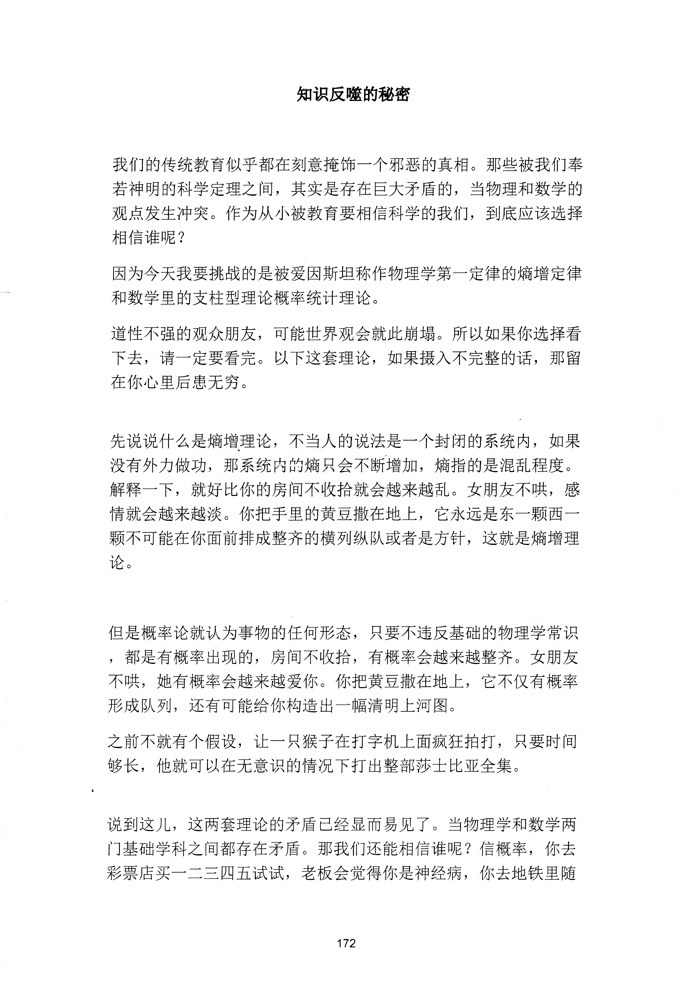
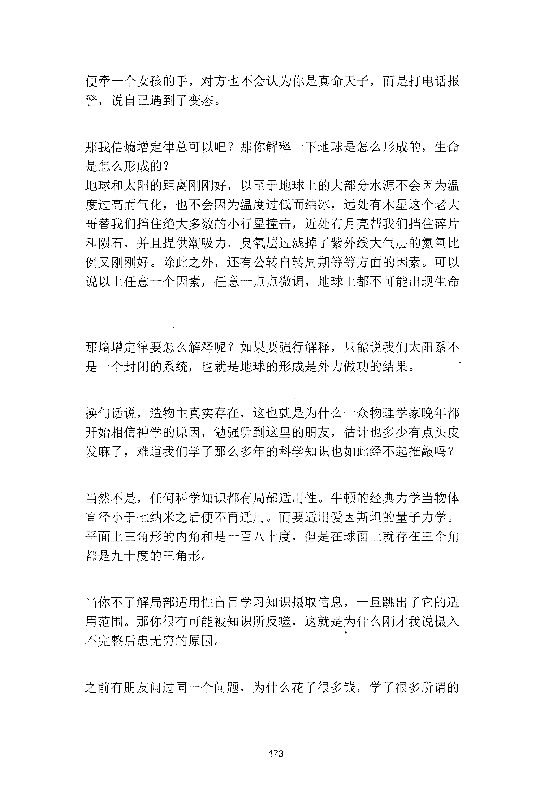
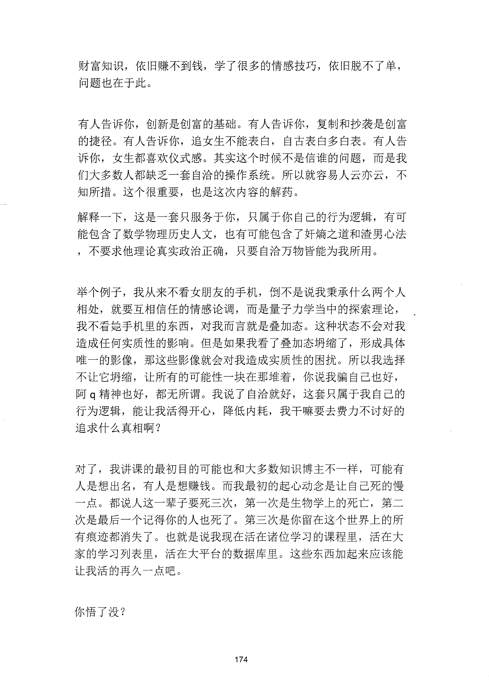

<!-- 原书第 180 页 -->

# 知识反噬的秘密

我们的传统教育似乎都在刻意掩饰一个邪恶的真相。那些被我们奉若神明的科学定理之间，其实是存在巨大矛盾的，当物理和数学的观点发生冲突。作为从小被教育要相信科学的我们，到底应该选择相信谁呢？因为今天我要挑战的是被爱因斯坦称作物理学第一定律的墒增定律和数学里的支柱型理论概率统计理论。道性不强的观众朋友，可能世界观会就此崩塌。所以如果你选择看下去，请一定要看完。以下这套理论，如果摄入不完整的话，那留在你心里后患无穷。

先说说什么是煽增理论，不当入的说法是一个封闭的系统内，如果没有外力做功，那系统内的墒只会不断增加，墒指的是混乱程度。解释一下，就好比你的房间不收拾就会越来越乱。女朋友不哄，感情就会越来越淡。你把手里的黄豆撒在地上，它永远是东一颗西一颗不可能在你面前排成整齐的横列纵队或者是方针，这就是煽增理论。

但是概率论就认为事物的任何形态，只要不违反基础的物理学常识，都是有概率出现的，房间不收拾，有概率会越来越整齐。女朋友不哄，她有概率会越来越爱你。你把黄豆撒在地上，它不仅有概率形成队列，还有可能给你构造出一幅清明上河图。之前不就有个假设，让一只猴子在打字机上面疯狂拍打，只要时间够长，他就可以在无意识的情况下打出整部莎士比亚全集。

说到这儿，这两套理论的矛盾已经显而易见了。当物理学和数学两门基础学科之间都存在矛盾。那我们还能相信谁呢？信概率，你去彩票店买一二三四五试试，老板会觉得你是神经病，你去地铁里随

<!-- source-image-start -->

查看原书第 180 页影像

<!-- source-image-end -->
<!-- 原书第 181 页 -->

便牵一个女孩的手，对方也不会认为你是真命天子，而是打电话报警，说自己遇到了变态。

那我信墒增定律总可以吧？那你解释一下地球是怎么形成的，生命是怎么形成的？地球和太阳的距离刚刚好，以至于地球上的大部分水源不会因为温度过高而气化，也不会因为温度过低而结冰，远处有木星这个老大哥替我们挡住绝大多数的小行星撞击，近处有月亮帮我们挡住碎片和陨石，并且提供潮吸力，臭氧层过滤掉了紫外线大气层的氮氧比例又刚刚好。除此之外，还有公转自转周期等等方面的因素。可以说以上任意一个因素，任意一点点微调，地球上都不可能出现生命

那墒增定律要怎么解释呢？如果要强行解释，只能说我们太阳系不是一个封闭的系统，也就是地球的形成是外力做功的结果。

换句话说，造物主真实存在，这也就是为什么一众物理学家晚年都开始相信神学的原因，勉强听到这里的朋友，估计也多少有点头皮发麻了，难道我们学了那么多年的科学知识也如此经不起推敲吗？

当然不是，任何科学知识都有局部适用性。牛顿的经典力学当物体直径小于七纳米之后便不再适用。而要适用爱因斯坦的量子力学。平面上三角形的内角和是一百八十度，但是在球面上就存在三个角都是九十度的三角形。

当你不了解局部适用性盲目学习知识摄取信息，一旦跳出了它的适用范围。那你很有可能被知识所反噬，这就是为什么刚才我说摄入不完整后患无穷的原因。

之前有朋友问过同一个问题，为什么花了很多钱，学了很多所谓的

<!-- source-image-start -->

查看原书第 181 页影像

<!-- source-image-end -->
<!-- 原书第 182 页 -->

财富知识，依旧赚不到钱，学了很多的情感技巧，依旧脱不了单，问题也在于此。

有人告诉你，创新是创富的基础。有人告诉你，复制和抄袭是创富的捷径。有人告诉你，追女生不能表白，自古表白多白表。有人告诉你，女生都喜欢仪式感。其实这个时候不是信谁的问题，而是我们大多数人都缺乏一套自治的操作系统。所以就容易人云亦云，不知所措。这个很重要，也是这次内容的解药。解释一下，这是一套只服务于你，只属于你自己的行为逻辑，有可能包含了数学物理历史人文，也有可能包含了奸煽之道和渣男心法，不要求他理论真实政治正确，只要自洽万物皆能为我所用。

举个例子，我从来不看女朋友的手机，倒不是说我秉承什么两个人相处，就要互相信任的情感论调，而是量子力学当中的探索理论，我不看她手机里的东西，对我而言就是叠加态。这种状态不会对我造成任何实质性的影响。但是如果我看了叠加态坍缩了，形成具体唯一的影像，那这些影像就会对我造成实质性的困扰。所以我选择不让它坍缩，让所有的可能性一块在那堆着，你说我骗自己也好，阿q 精神也好，都无所谓。我说了自洽就好，这套只属于我自己的行为逻辑，能让我活得开心，降低内耗，我干嘛要去费力不讨好的追求什么真相啊？

对了，我讲课的最初目的可能也和大多数知识博主不一样，可能有人是想出名，有人是想赚钱。而我最初的起心动念是让自己死的慢一点。都说人这一辈子要死三次，第一次是生物学上的死亡，第二次是最后一个记得你的人也死了。第三次是你留在这个世界上的所有痕迹都消失了。也就是说我现在活在诸位学习的课程里，活在大家的学习列表里，活在大平台的数据库里。这些东西加起来应该能让我活的再久一点吧。

你悟了没？

<!-- source-image-start -->

查看原书第 182 页影像

<!-- source-image-end -->
