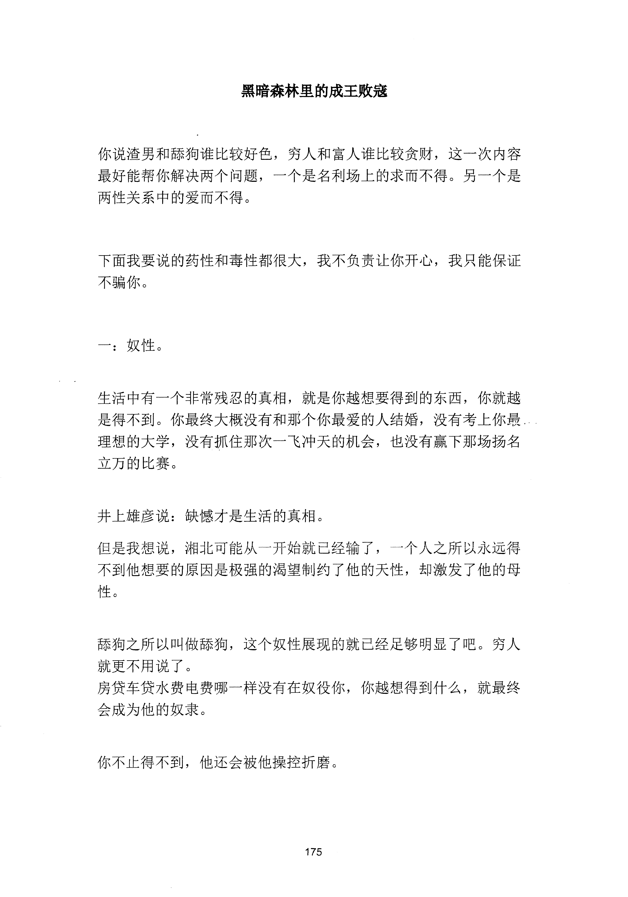
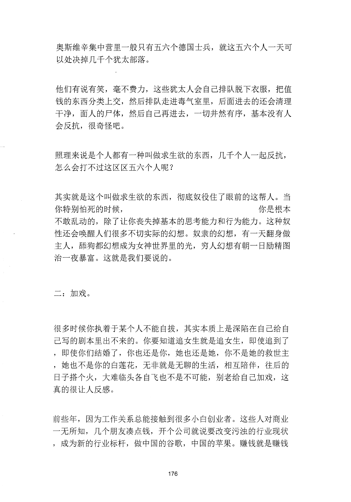
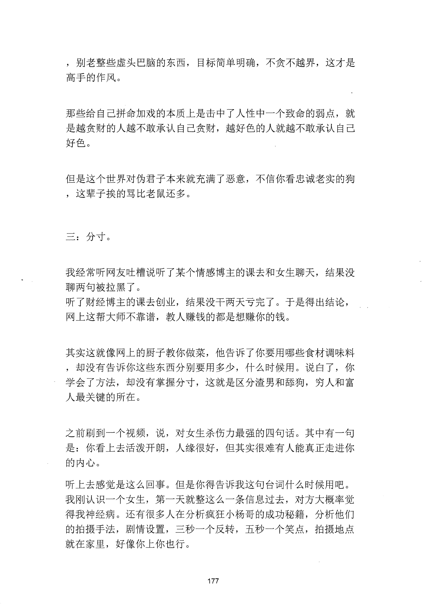
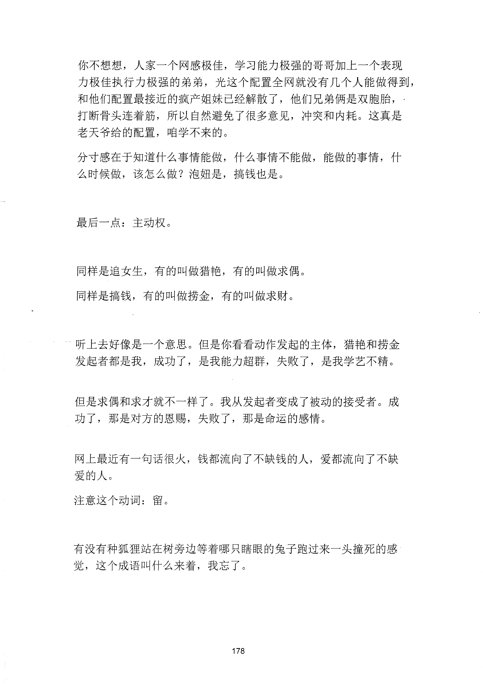
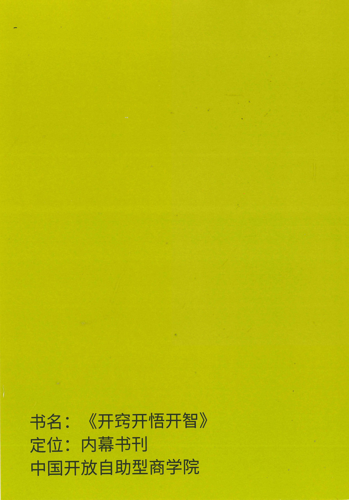

<!-- 原书第 183 页 -->

# 黑暗森林里的成王败寇

你说渣男和舔狗谁比较好色，穷人和富人谁比较贪财，这一次内容最好能帮你解决两个问题，一个是名利场上的求而不得。另一个是两性关系中的爱而不得。

下面我要说的药性和毒性都很大，我不负责让你开心，我只能保证不骗你。

一：奴性。

生活中有一个非常残忍的真相，就是你越想要得到的东西，你就越是得不到。你最终大概没有和那个你最爱的人结婚，没有考上你愚理想的大学，没有抓住那次一飞冲天的机会，也没有赢下那场扬名立刀的比赛。

井上雄彦说：缺憾才是生活的真相。但是我想说，湘北可能从一开始就已经输了，

叶个人之所以永远得不到他想要的原因是极强的渴望制约了他的天性，却激发了他的母性。

舔狗之所以叫做舔狗，这个奴性展现的就已经足够明显了吧。穷人就更不用说了。房贷车贷水费电费哪一样没有在奴役你，你越想得到什么，就最终会成为他的奴隶。

你不止得不到，他还会被他操控折磨。

<!-- source-image-start -->

查看原书第 183 页影像

<!-- source-image-end -->
<!-- 原书第 184 页 -->

奥斯维辛集中营里一般只有五六个德国士兵，就这五六个人一天可以处决掉几千个犹太部落。

他们有说有笑，毫不费力，这些犹太人会自己排队脱下衣服，把值钱的东西分类上交，然后排队走进毒气室里，后面进去的还会清理于净，面人的尸体，然后自己再进去，一切井然有序，基本没有人会反抗，很奇怪吧。

照理来说是个人都有一种叫做求生欲的东西，几千个人一起反抗，怎么会打不过这区区五六个人呢？

其实就是这个叫做求生欲的东西，彻底奴役住了眼前的这帮人。当你特别怕死的时候，

你是根本不敢乱动的，除了让你丧失掉基本的思考能力和行为能力。这种奴性还会唤醒人们很多不切实际的幻想。奴隶的幻想，有一天翻身做主人，秤狗都幻想成为女神世界里的光，穷人幻想有朝一日励精图治一夜暴富。这就是我们要说的。

二：加戏。

很多时候你执着于某个人不能自拔，其实本质上是深陷在自己给自己写的剧本里出不来的。你要知道追女生就是追女生，即使追到了，即使你们结婚了，你也还是你，她也还是她，你不是她的救世主，她也不是你的白莲花，无非就是无聊的生活，相互陪伴，往后的日子搭个火，大难临头各自飞也不是不可能，别老给自己加戏，这真的很让人反感。

前些年，因为工作关系总能接触到很多小白创业者。这些人对商业一无所知，几个朋友凑点钱，开个公司就说要改变污浊的行业现状，成为新的行业标杆，做中国的谷歌，中国的苹果。赚钱就是赚钱

<!-- source-image-start -->

查看原书第 184 页影像

<!-- source-image-end -->
<!-- 原书第 185 页 -->

，别老整些虚头巴脑的东西，目标简单明确，不贪不越界，这才是高手的作风。

那些给自己拼命加戏的本质上是击中了人性中一个致命的弱点，就是越贪财的人越不敢承认自己贪财，越好色的人就越不敢承认自己好色。

但是这个世界对伪君子本来就充满了恶意，不信你看忠诚老实的狗，这辈子挨的骂比老鼠还多。

三：分寸。

我经常听网友吐槽说听了某个情感博主的课去和女生聊天，结果没聊两旬被拉黑了。听了财经博主的课去创业，结果没千两天亏完了。于是得出结论，网上这帮大师不靠谱，教人赚钱的都是想赚你的钱。

其实这就像网上的厨子教你做菜，他告诉了你要用哪些食材调味料，却没有告诉你这些东西分别要用多少，什么时候用。说白了，你学会了方法，却没有掌握分寸，这就是区分渣男和舔狗，穷人和富人最关键的所在。

之前刷到一个视频，说，对女生杀伤力最强的四句话。其中有一句是：你看上去活泼开朗，人缘很好，但其实很难有人能真正走进你的内心。听上去感觉是这么回事。但是你得告诉我这句台词什么时候用吧。我刚认识一个女生，第一天就整这么一条信息过去，对方大概率觉得我神经病。还有很多人在分析疯狂小杨哥的成功秘籍，分析他们的拍摄手法，剧情设置，三秒一个反转，五秒一个笑点，拍摄地点就在家里，好像你上你也行。

<!-- source-image-start -->

查看原书第 185 页影像

<!-- source-image-end -->
<!-- 原书第 186 页 -->

你不想想，人家一个网感极佳，学习能力极强的哥哥加上一个表现力极佳执行力极强的弟弟，光这个配置全网就没有几个人能做得到，和他们配置最接近的疯产姐妹已经解散了，他们兄弟俩是双胞胎，打断骨头连着筋，所以自然避免了很多意见，冲突和内耗。这真是老天爷给的配置，咱学不来的。分寸感在千知道什么事情能做，什么事情不能做，能做的事情，什么时候做，该怎么做？泡妞是，搞钱也是。

最后一点：主动权。

同样是追女生，有的叫做猎艳，有的叫做求偶。同样是搞钱，有的叫做捞金，有的叫做求财。

听上去好像是一个意思。但是你看看动作发起的主体，猎艳和捞金发起者都是我，成功了，是我能力超群，失败了，是我学艺不精。

但是求偶和求才就不一样了。我从发起者变成了被动的接受者。成功了，那是对方的恩赐，失败了，那是命运的感情。

网上最近有一句话很火，钱都流向了不缺钱的人，爱都流向了不缺爱的人。注意这个动词：留。

有没有种狐狸站在树旁边等着哪只瞎眼的兔子跑过来一头撞死的感觉，这个成语叫什么来着，我忘了。

<!-- source-image-start -->

查看原书第 186 页影像

<!-- source-image-end -->
<!-- 原书第 187 页 -->

你悟了没？

<!-- source-image-start -->

查看原书第 187 页影像

<!-- source-image-end -->
<!-- 原书第 188 页 -->

书名：

《开窍开悟开智》定位：内幕书刊中国开放自助型商学院

<!-- source-image-start -->

查看原书第 188 页影像

<!-- source-image-end -->
